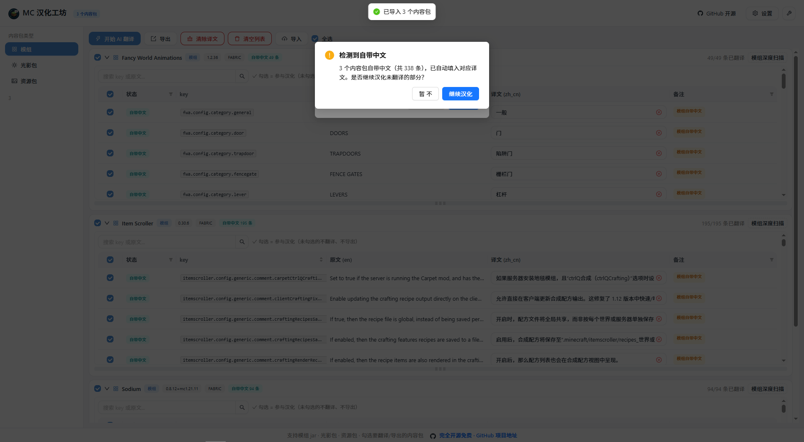
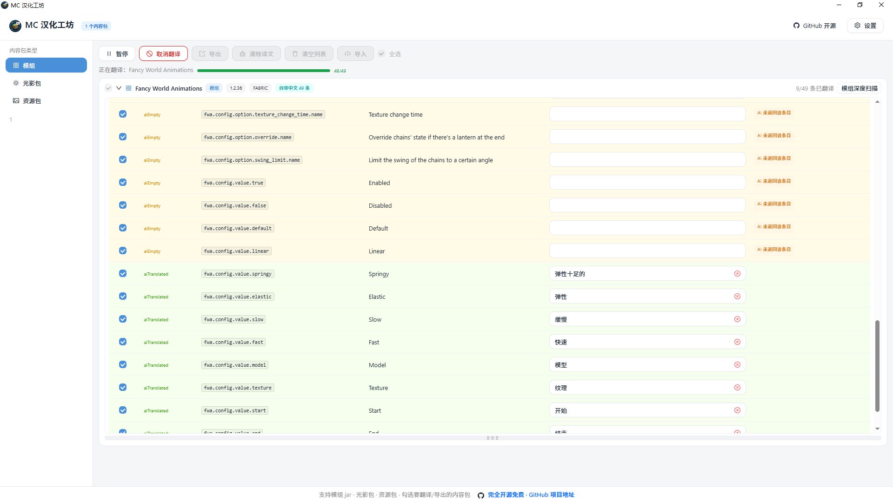
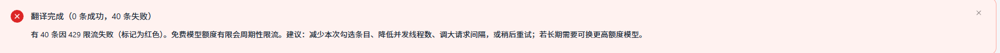
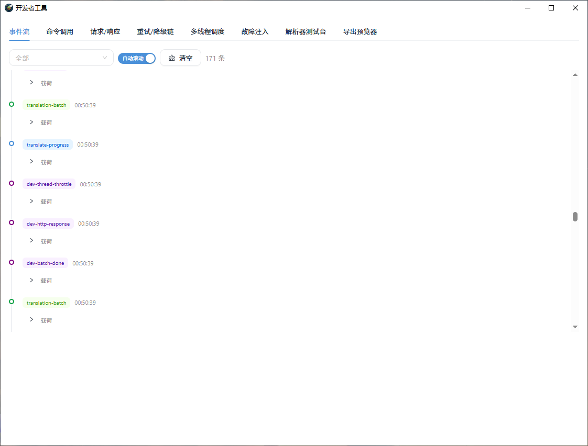
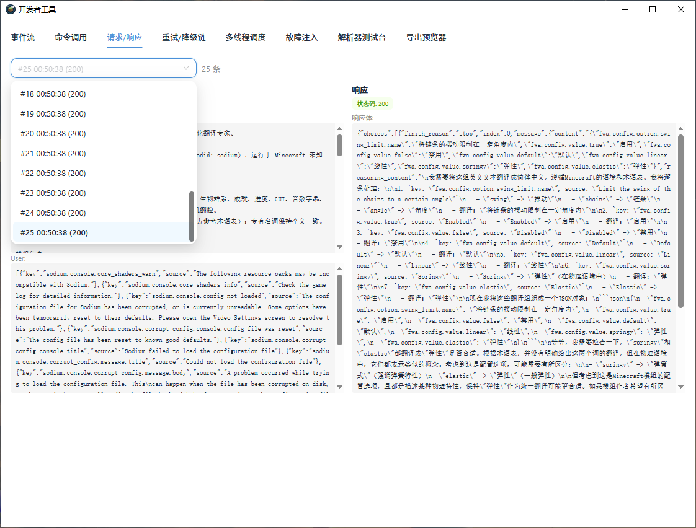
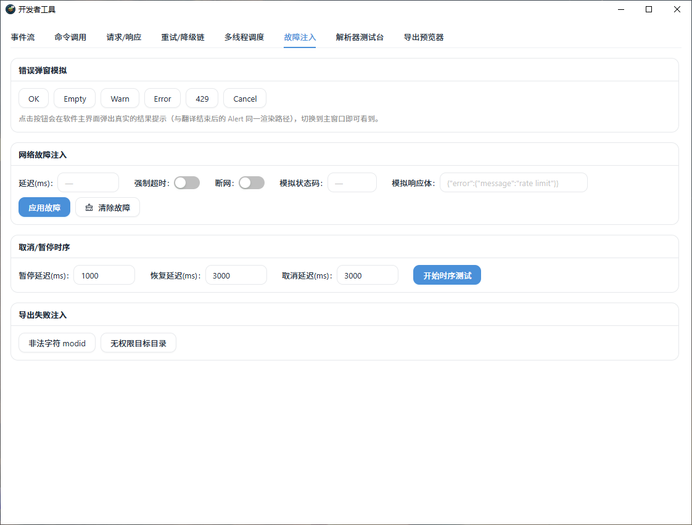
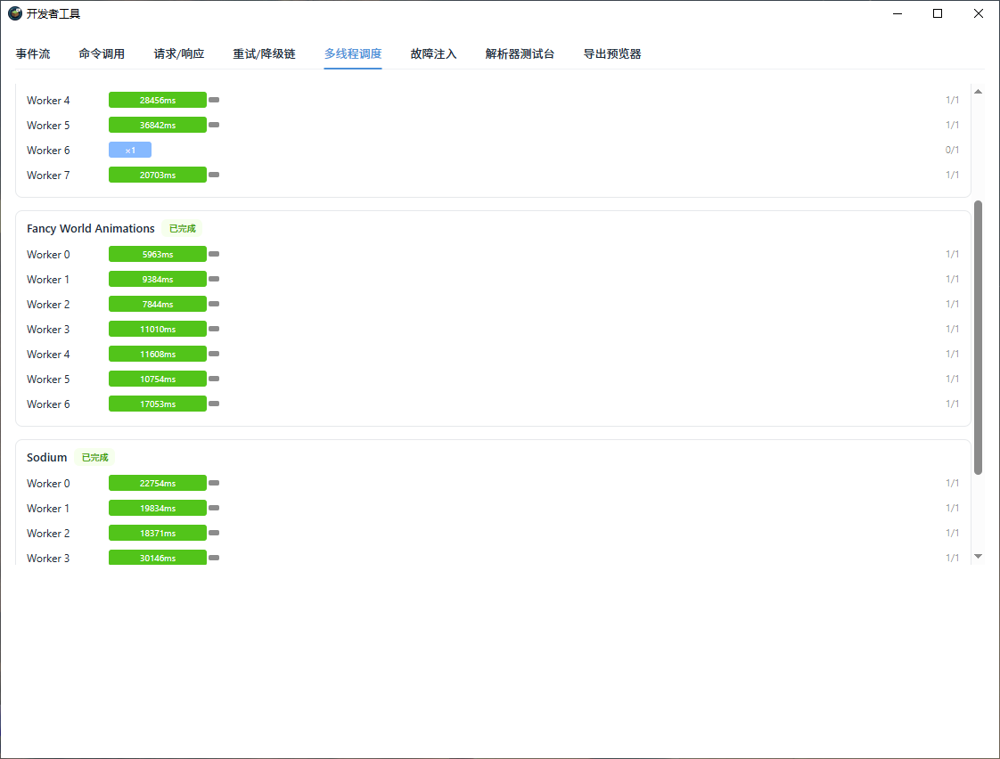
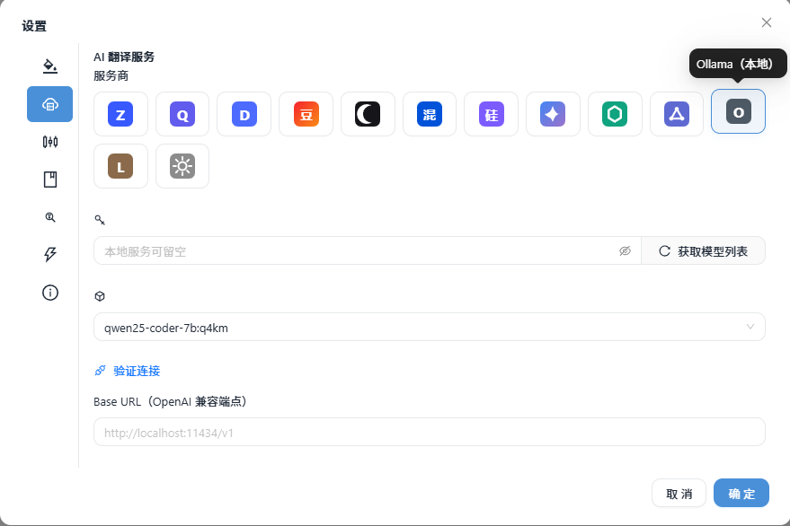

<p align="center">
  
</p>

<h1 align="center">MC 汉化工坊</h1>

<p align="center">
  面向《我的世界》模组、光影包与资源包的 AI 汉化桌面工具
</p>
<p align="center">
  <a href="https://get.microsoft.com/installer/download/9p9bn1lhbjk4?referrer=appbadge" target="_self">
    
  </a>
</p>

<p align="center">
  
  
  
  
</p>

<p align="center">
  <a href="#功能一览">功能一览</a> ·
  <a href="#快速开始">快速开始</a> ·
  <a href="#如何获取-api-key">如何获取 API Key</a> ·
  <a href="#开发者工具">开发者工具</a> ·
  <a href="#数据与隐私">数据与隐私</a> ·
  <a href="#项目架构">项目架构</a> ·
  <a href="#数据处理流程">数据处理流程</a> ·
  <a href="#开发与构建">开发与构建</a> ·
  <a href="#版本记录">版本记录</a> ·
  <a href="#致谢">致谢</a>
</p>


---


MC 汉化工坊基于 Tauri v2 + React + TypeScript + Rust 构建，当前发布 Windows x64 安装包，其他平台可从源码自行构建。将模组 jar、光影包或资源包拖入窗口，即可自动解析可翻译文本，结合上下文完成 AI 汉化，并导出为汉化资源包、汉化后的模组 jar 或汉化光影包。


> **⚡ 实测速率**：付费模型智谱 `glm-4.5-air` + 并行加速，约 **110 秒**完成 3 个内容包共 350 条翻译。
> 实际速率因模型、网络与服务商限流而异，请以实际使用为准；**免费模型大概率因限流无法开启并行与内容包并行**，建议单线程或低并发使用。

---

## 功能一览

| 功能 | 说明 |
|---|---|
| 三类内容包支持 | 模组 `.jar`、光影包 `.zip`、资源包 `.zip`，自动探测类型 |
| 拖放导入 | 支持拖放或点击选择，可多选导入 |
| 自动解析 | 提取 `assets/<modid>/lang/` 语言文件、光影 `shaders.properties`、资源包 `pack.mcmeta` 描述 |
| 中文检测 | 自动识别已有简体中文/繁体中文，繁体自动转简体后填入 |
| 条目级选择 | 逐条勾选是否参与翻译与导出，支持全选/全不选 |
| 批量勾选 | 按住行内空白处拖动，框选多行后批量勾选或取消 |
| 直接编辑 | 译文单元格点击即可修改，单条可清除后重新翻译 |
| 上下文感知翻译 | 模组/光影包/资源包分别使用差异化提示词与术语表 |
| 占位符保护 | `%s`、`%1$s`、`%d`、`\n`、`§` 格式码翻译后自动校验 |
| 硬编码文本扫描 | 扫描 `advancements/`、`patchouli_books/`、`config/` 等目录中的英文并回写 |
| 多服务商 | 智谱 GLM、Google Gemini、DeepSeek、阿里百炼 Qwen、自定义 OpenAI 兼容接口 |
| 多线程加速 | 1-8 线程并行翻译，支持暂停/取消/恢复 |
| 内容包并行翻译 | 同时翻译 2/4/8 个内容包或无限制，各包独立实时进度与完成提示 |
| 批次智能优化 | 每批条数自动按线程数取最优（默认开启）；小批次质量风险主动提醒 |
| 译文质量检测 | 「译文与原文相同」批量检测，弹窗一键清除重译 |
| 标签化清除译文 | 按备注标签勾选清除，备注列支持表头筛选 |
| 开发者工具（可选版本） | 请求/响应原文、事件流、两级调度视图、故障注入、解析器测试台、导出预览器 |
| 多种导出 | 合并汉化资源包、汉化 jar、汉化光影包、改描述资源包 |
| pack_format 自动匹配 | 按 Minecraft 版本自动匹配资源包格式号 |

---

## 快速开始

1. **下载安装**：从 [Releases](https://github.com/adssadax-1/mc-content-localizer/releases) 下载 Windows x64 安装包（NSIS 或 MSI），或 clone 源码自行构建。
2. **配置 API Key**：右上角「设置」→ 选择服务商 → 填入 API Key → 获取模型列表 → 选择模型 → 保存。
3. **导入内容包**：拖入文件或点击中央区域选择，程序自动识别类型并解析可翻译条目。



4. **开始翻译**：勾选需要翻译的内容包，点击「开始 AI 翻译」，可实时查看进度。


翻译过程中条目按状态实时着色（翻译中 / 已汉化 / AI 未返回 / 翻译失败），进展一目了然：



翻译结束后汇总本次结果与针对性建议：



5. **人工审校**：在表格中直接修改译文；对不满意的条目可点击右侧清除按钮重新翻译。


6. **导出**：点击「导出」选择目标格式：
   - 模组：合并汉化资源包 / 汉化 jar（不覆盖原文件）
   - 光影包：生成 `xxx_zh_CN.zip`
   - 资源包：生成改描述后的资源包

> 1.12.2 及更早版本的中文显示需要字体补丁，导出 `.lang` 时程序会给出提示。

### 拖动批量勾选

按住表格行内空白处（原文/key/状态列）上下拖动，框选范围内的行自动勾选；从已勾选行开始拖动则批量取消。拖到表格上下边缘会自动滚动，便于连续选中大片区域。复选框、按钮、输入框等交互元素不触发框选。


### 翻译加速

设置 →「翻译加速」：


- **并行加速（线程数 1-8 + 请求间隔）**：并行发送翻译请求，提升整体速度；间隔越大越不容易触发限流（推荐 ≥ 4s）
- **每批条数自动最优（默认开启）**：每批条数 = 待翻译条目数 ÷ 线程数，线程满载速率最优；条目过少导致批次过小时会主动提醒
- **内容包并行翻译**：同时翻译 2 / 4 / 8 个内容包或无限制，每个内容包独立实时进度与完成提示
- **风险提示**：**免费模型大概率因限流无法开启并行与内容包并行**——免费模型通常有账号级速率限制，多线程/多包并发容易触发 429（程序会自动退避重试）。具体以各服务商限速为准：OpenRouter 免费模型可开 8 线程，智谱免费模型（glm-4-flash 系列）建议 1-2 线程，付费模型（glm-4.5 等）可开 4-8 线程提速明显。同模型批量翻译可保持译名风格一致。

---

## 开发者工具（可选版本）

提供独立构建的「开发者工具版」，安装后 Header 多一个工具按钮，点开为独立工具窗口，8 个面板全部实时：

| 面板 | 功能 |
|---|---|
| 事件流 | 所有 Tauri 事件实时时间线，可过滤、载荷展开收起 |
| 命令调用 | 每次 invoke 的命令 / 参数 / 状态 / 耗时 |
| 请求/响应 | 发送给模型的 System / User 提示词全文与响应原文 |
| 重试/降级链 | 429 退避、JSON 模式降级过程可视化 |
| 多线程调度 | 两级视图：内容包 → 线程，色块 = 批次，闪烁 = 进行中 |
| 故障注入 | 六类结果弹窗、断网 / 模拟 429 / 强制超时 / 延迟注入、时序测试、导出失败 |
| 解析器测试台 | 粘贴或导入语言文件即时解析，占位符校验，可导出 |
| 导出预览器 | 不写盘预览 zip 结构、文件名清洗、mcmeta 内容 |









> 获取方式：Releases 下载带 `DevTools` 后缀的安装包（可与正式版共存安装），或源码构建见[开发与构建](#开发与构建)。正式版不含任何开发者工具代码。

---

## 如何获取 API Key

在程序右上角「设置」中配置翻译服务，各服务商独立保存 Key 与模型选择：


v2.0 起内置 11 家服务商预设（智谱 / 通义 / DeepSeek / 火山豆包 / Kimi / 腾讯混元 / 硅基流动 / Google Gemini / OpenAI / OpenRouter / 自定义），图标网格点选即切，各服务商 Key 与模型独立保存。v2.0.1 起进一步优化：模型列表改为可搜索下拉，免费模型带「免费」标注并优先排序；预设服务商 BaseURL 只读展示并附官网跳转；新增「验证连接」一键检测所选模型是否可用：



### 智谱 GLM（推荐：有免费模型，国内直连）

1. 打开 [智谱开放平台](https://open.bigmodel.cn/) 注册并完成手机号实名认证。
2. 进入控制台 →「API 密钥」→「创建新的密钥」。
3. 复制 Key，在程序设置中选择「智谱 GLM」并粘贴，点击「获取模型列表」。

免费模型：`glm-4-flash-250414`、`glm-4.7-flash`（有并发与每日额度，触发限流会自动退避重试）。付费模型按 token 计费。

### Google Gemini（免费层）

1. 打开 [Google AI Studio](https://aistudio.google.com/apikey)，用 Google 账号登录。
2. 点击「Create API key」生成 Key。
3. 在程序设置中选择「Google Gemini」粘贴即可。

注意：免费层有请求额度限制，内容可能用于训练，敏感数据请勿使用。

### DeepSeek（低价）

1. 打开 [platform.deepseek.com](https://platform.deepseek.com/) 注册并充值。
2. 左侧「API Keys」→「创建 API Key」。
3. 在程序设置中选择「DeepSeek」粘贴。

实测（`deepseek-chat`）：翻译 40 条模组汉化内容约消耗 9,710 tokens，费用约 ¥0.01 元。实际价格以官方扣费为准。


### 阿里百炼 Qwen（低价）

1. 打开 [阿里云百炼](https://bailian.console.aliyun.com/) 开通模型服务并完成实名。
2. 控制台右上角「API-KEY」→ 创建。
3. 在程序设置中选择「阿里百炼 Qwen」粘贴。

> 所有服务商均支持「获取模型列表」一键拉取，免费模型在列表中有「免费模型」标注。

---

## 数据与隐私

- **API Key 存储**：仅保存在本机配置文件（`%APPDATA%/com.administrator.mod-translator/settings.json`，macOS 为 `~/Library/Application Support/...`），不上传至任何第三方、不入仓库、不进日志。
- **翻译内容**：条目文本仅发送给你自己选择的服务商用于翻译。
- **翻译质量提示**：AI 翻译仅供参考，建议导出前人工审校；专有名词可通过「设置 → 自定义术语表」锁定译名。

---

## 项目架构

本项目采用 Tauri v2 混合架构：前端使用 React + TypeScript 负责界面与交互，后端使用 Rust 负责文件解析、翻译流水线与导出。前后端通过 Tauri 的 invoke 命令与事件机制通信。

```
┌─────────────────────────────────────────────────────────────┐
│  前端（React + TypeScript）                                   │
│  ├─ App.tsx              主布局、内容包队列、翻译/导出流程     │
│  ├─ components/          DropZone / EntryTable / SettingsModal │
│  │                       / DevToolsPanel / PromptEditorModal 等 │
│  ├─ devtools/            开发者工具独立窗口入口与事件契约      │
│  │                       （__DEVTOOLS__ 门控，生产构建剔除）  │
│  ├─ api.ts               Tauri invoke 与事件封装            │
│  ├─ i18n.tsx              中英双语（缺 key 回退中文）          │
│  └─ types.ts             类型定义、pack_format 版本对照、     │
│                           服务商预设                          │
├─────────────────────────────────────────────────────────────┤
│  后端（Rust / src-tauri/src）                                │
│  ├─ commands.rs         Tauri 命令层（解析/翻译/导出/设置）  │
│  │   └─ devtools 模块    dev_* 命令（仅 devtools feature）     │
│  ├─ dev.rs              devtools 插桩：事件广播/故障注入      │
│  │                       （feature 门控，生产零代码）          │
│  ├─ core/                jar 解包、lang/json 解析、占位符处理   │
│  │   ├─ jar.rs           模组 jar 解析                        │
│  │   ├─ pack.rs          光影包 / 资源包解析                  │
│  │   ├─ json_lang.rs     JSON 语言文件（1.13+）              │
│  │   ├─ lang.rs           legacy .lang 文件（1.12.2）         │
│  │   ├─ placeholder.rs    占位符与格式码校验                  │
│  │   ├─ deep_scan.rs     硬编码文本深度扫描                   │
│  │   └─ model.rs         通用数据模型                         │
│  ├─ translate/           AI 翻译流水线                        │
│  │   ├─ provider.rs      OpenAI 兼容客户端（含故障注入点）    │
│  │   └─ pipeline.rs      术语表提取、分批翻译、重试、校验     │
│  ├─ export.rs            资源包 / 汉化 jar 导出               │
│  └─ settings.rs          设置持久化（含并行翻译配置）          │
└─────────────────────────────────────────────────────────────┘
```

---

## 数据处理流程

内容包从导入到导出的完整流程如下：

```
导入文件
   │
   ▼
类型探测 ──► 模组 jar ──┬── 解析 mods.toml / fabric.mod.json / mcmod.info
                       │   提取 assets/<modid>/lang/ 语言文件
                       │   识别已有中文（繁转简）
                       │   可选：深度扫描 advancements / patchouli_books / config
                       │
                       ├── 光影包 ── 解析 shaders.properties / shaders/lang/en_US.lang
                       │
                       └── 资源包 ── 解析 pack.mcmeta description
   │
   ▼
生成条目列表（原文 / key / 状态）
   │
   ▼
用户勾选 + 审校编辑
   │
   ▼
开始翻译 ──► 术语表提取（第一轮）
            内容包并行调度（可选：2/4/8 个包同时翻译）
            每包分批翻译（单线程或多线程，批次数可自动最优）
            占位符 / 格式码校验 + 「译文与原文相同」检测
            失败自动重试 + 429 退避
   │
   ▼
导出结果 ──► 合并汉化资源包 zip
            汉化后的模组 jar
            汉化光影包 zip
            改描述资源包 zip
```

---

## 开发与构建

```bash
# 环境要求
# - Node.js 18+ 与 npm
# - Rust stable（rustup）
# - Windows: Visual Studio Build Tools（C++ 桌面开发工作负载）
# - macOS: Xcode Command Line Tools
# - Linux: webkit2gtk 等依赖

# 安装依赖
npm install

# 开发模式（热重载）
npm run tauri dev

# 开发模式（含开发者工具面板与 dev 命令）
npm run tauri:dev:devtools

# 运行 Rust 单元测试
cd src-tauri && cargo test

# 打包安装程序（NSIS/MSI 等，按平台）——正式版，不含开发者工具
npm run tauri build

# 打包含开发者工具的安装包（产品名独立，可与正式版共存安装）
npm run tauri:build:devtools

# 仅构建免安装版 exe（不打安装包）
npm run tauri build -- --no-bundle
```

---

## 开源协议

本项目使用 **MIT 协议**，详见 [LICENSE](LICENSE) 文件。

---

## 版本记录

### v2.1.0（2026-09）

- **内容包并行翻译**：同时翻译 2/4/8 个内容包或无限制，各包独立实时进度与完成提示
- **翻译加速转正**：去掉实验性标记；「每批条数」支持按线程数自动取最优（默认开启）
- **译文质量检测**：批量检测「译文与原文相同」，弹窗一键清除重译
- **清除译文按标签勾选**：备注列新增表头筛选与分类着色
- **开发者工具版（可选构建）**：独立窗口 8 面板——事件流、命令调用、请求/响应全文、重试/降级链、两级调度视图、故障注入、解析器测试台、导出预览器；正式版零 devtool 代码
- **界面**：暗色主题修复输入框/滚动条白色问题；设置与提示词编辑器全面接入英文

### v2.0.2（2026-08）

- **报错提示全面优化**：导出失败、API Key 未配置、翻译完成汇总、解析失败、无译文可导出、设置加载失败六类提示重写为可操作文案，并统一前后端措辞
- **修复导出文件名非法字符报错**：模组标识或文件名含 Windows 非法字符（`* ? : < > | / \ "`）时自动清洗后再导出，不再触发「无法创建文件 (os error 123)」
- **导出失败提示**：失败时展示目标路径与可能原因（磁盘空间不足 / 无写入权限 / 文件被其他程序占用）
- **解析失败分类提示**：区分「文件损坏或被占用」与「无法识别为可翻译内容」两类，分别给出处理建议
  
### v2.0.1（2026-08）

- **翻译加速描述更新**：风险提示细化，按各服务商官网限速给出线程数建议——OpenRouter 免费模型可开 8 线程，智谱免费模型（glm-4-flash 系列）建议 1-2 线程，付费模型（glm-4.5 等）可开 4-8 线程提速明显；同步更新「翻译加速」设置区截图与说明
- **服务商预设优化**：模型列表改为可搜索下拉（原生虚拟化，支持数百项），名称含 free 的免费模型带「免费」标注并在搜索时优先排序；预设服务商 BaseURL 改为只读展示并附官网跳转链接；新增「验证连接」按钮，一键发送最小请求检测所选 API Key + Base URL + 模型是否可用

### v2.0.0（2026-08）

- **实时译文推送**：翻译过程逐批实时回填条目并按状态着色（翻译中 / 已汉化 / AI 未返回 / 翻译失败），结束后汇总成功、未返回、限流与占位符警告数量，长任务全程可观察
- **页面设置（新增设置分组，置顶默认）**：亮色 / 暗色主题一键切换（表格行色、边框、卡片等全量适配）；界面中英文一键切换（全部文案国际化，各选项独立配置互不影响）
- **AI 服务商预设 5 → 11 家**：新增火山豆包、Kimi 月之暗面、腾讯混元、硅基流动、OpenRouter、OpenAI；DeepSeek 默认模型更新为 `deepseek-v4-flash`；服务商选择改为品牌图标网格，Key 与模型按服务商独立保存
- **设置界面重构**：左侧分组导航（页面设置 / 服务商与模型 / 翻译参数 / 术语表 / 翻译加速 / 关于），分组即点即切
- **全局过渡动画**：内容包卡片交错入场、内容页签切换淡入、设置分组滑入过渡、服务商网格悬停反馈；仅动画 transform/opacity（GPU 合成），低内存占用
- **全新应用图标**：草方块 × 翻译气泡 SVG 形象，替换应用全套图标与界面展示

### v1.3.0（2026-08）

- **优化了交互体验**：译文编辑与列表操作更流畅
- 深度扫描文本解析简化并强化，可扫描文本格式扩展为 `.ini`、`.mcmeta`、`.bbmodel`
- **修复**：译文为空时右键菜单粘贴导致列表回顶
-  译文栏中长按回退键导致软件卡顿
-  译文为空时按回退键导致列表回顶

### v1.2.0（2026-08）

- 模组深度扫描：类型探测支持数据包式模组；无语言文件的模组引导启用深度扫描
- 深度扫描覆盖成就、配置、嵌套 jar 等内嵌文本，分组勾选 + 默认不勾选 + 导出风险提示

### v1.1.0（2026-08）

- 自定义提示词：模组/光影包/资源包三套分开定制，核心段系统锁定
- § 格式码效果预览：悬停译文预览最终颜色/样式
- 导出后「打开所在文件夹」：右下角通知一键定位
- 版本检查：启动静默检查 + 设置手动检查
- 剩余时间估算：进度条实时推算
- 术语管理闭环：提取的术语一键加入用户术语表；翻译完成建议高频词入表
- 检查更新命令区分「最新/有新版/网络失败」三态

### v1.0.0（2026-08）正式版

- 三类内容包：模组 jar / 光影包 / 资源包，自动类型探测，独立队列
- 光影包汉化：解析 shaders.properties + 导出 zh_CN.lang
- 资源包汉化：解析 pack.mcmeta description + 导出改描述包
- 差异化翻译提示词：模组 / 光影包 / 资源包三套语境
- 条目级汉化选择：逐条勾选是否参与翻译
- 拖动批量勾选：框选 + 边缘自动滚动
- 译文直接编辑：点击即改
- 多线程翻译加速（实验性）：1-8 线程 + 请求间隔 + 速率建议
- 性能优化：卡片/行级 memo + 虚拟滚动
- 修复：导出文件验证、description 多格式解析、光影空 properties 回退、类型误判

### v0.2.0（2026-08）

- 多模组队列、点击导入、自带中文检测（繁转简）、硬编码文本扫描、JSONC 兼容
- 单条清除译文、清空列表、拖动调节高度、多模组导出、无元数据模组解析

### v0.1.0（2026-08）

- 初版：拖放导入、AI 翻译、人工审校、多服务商、导出资源包/汉化 jar、pack_format 自动匹配

---

## 致谢

- [Y-RyuZU/MinecraftModsLocalizer](https://github.com/Y-RyuZU/MinecraftModsLocalizer)（Tauri + AI 翻译思路）
- [Tryanks/WebTranslator](https://github.com/Tryanks/WebTranslator)（.lang / json 双格式处理）
- [CFPAOrg/Minecraft-Mod-Language-Package](https://github.com/CFPAOrg/Minecraft-Mod-Language-Package)（社区翻译对照与字体补丁）
- Minecraft Wiki（pack_format 版本对照表）
