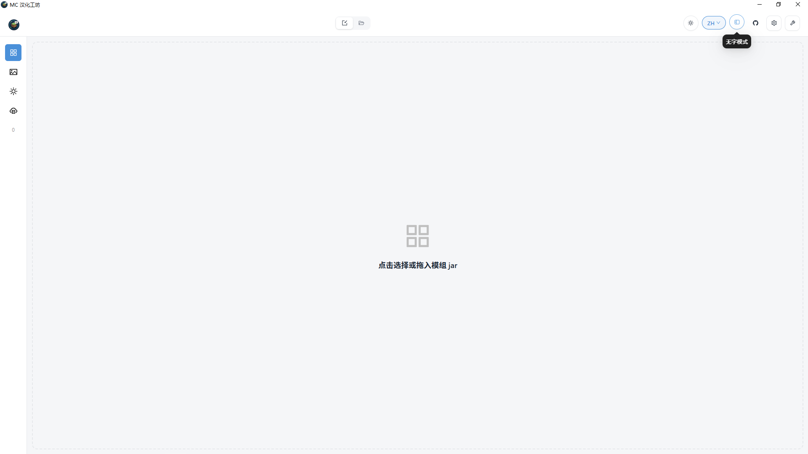
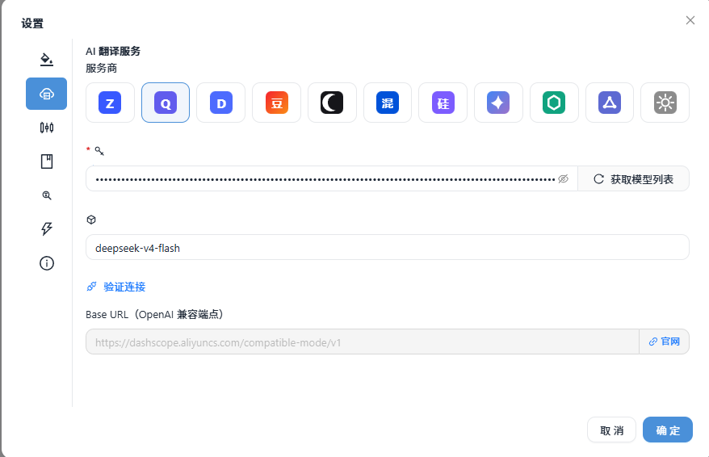
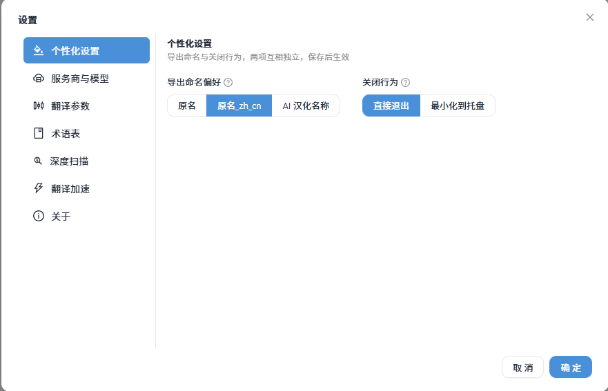
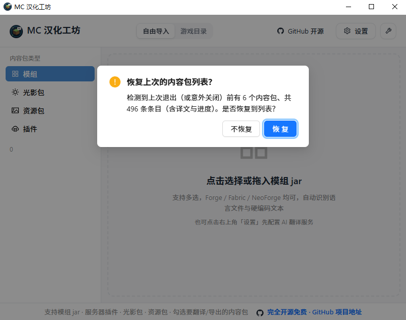
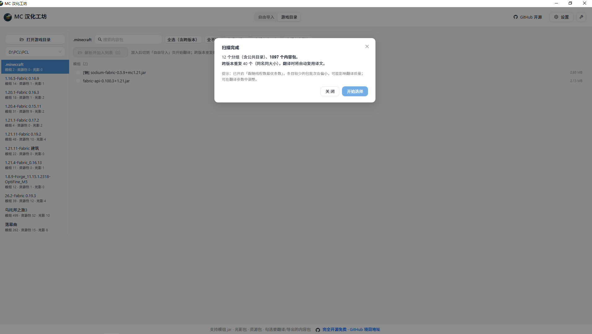
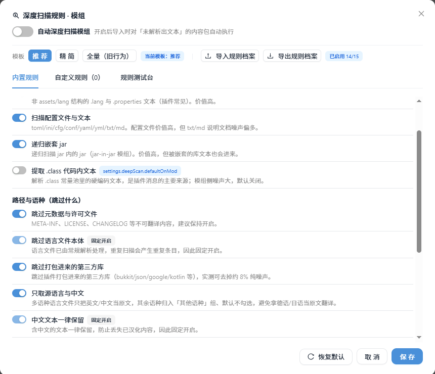
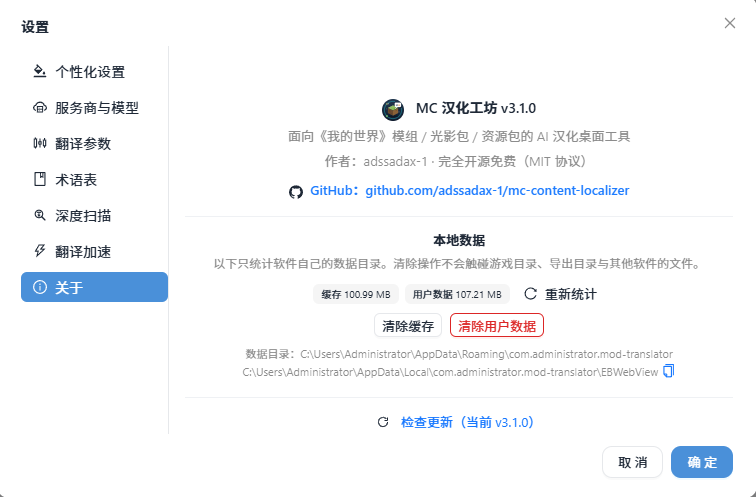
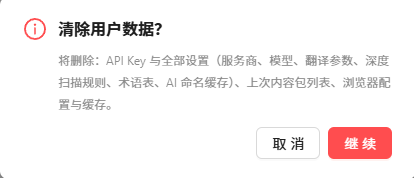
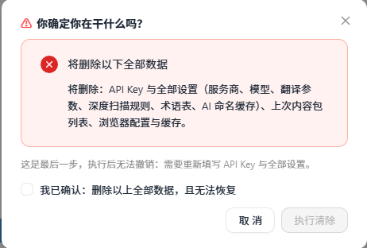

<p align="center">
  
</p>

<h1 align="center">MC 汉化工坊</h1>

<p align="center">
  面向《我的世界》模组、服务器插件、光影包与资源包的 AI 汉化桌面工具
</p>
<p align="center">
  <a href="https://get.microsoft.com/installer/download/9p9bn1lhbjk4?referrer=appbadge" target="_self">
    
  </a>
</p>

<p align="center">
  
  
  
  
</p>

<p align="center">
  <a href="#功能一览">功能一览</a> ·
  <a href="#快速开始">快速开始</a> ·
  <a href="#如何获取-api-key">如何获取 API Key</a> ·
  <a href="#开发者工具">开发者工具</a> ·
  <a href="#数据与隐私">数据与隐私</a> ·
  <a href="#项目架构">项目架构</a> ·
  <a href="#数据处理流程">数据处理流程</a> ·
  <a href="#开发与构建">开发与构建</a> ·
  <a href="#版本记录">版本记录</a> ·
  <a href="#致谢">致谢</a>
</p>


---


MC 汉化工坊基于 Tauri v2 + React + TypeScript + Rust 构建，当前发布 Windows x64 安装包，其他平台可从源码自行构建。将模组 jar、服务器插件 jar、光影包或资源包拖入窗口，即可自动解析可翻译文本，结合上下文完成 AI 汉化，并导出为汉化资源包、汉化后的模组 / 插件 jar 或汉化光影包。v2.3 新增游戏目录模式：直接扫描 `.minecraft` 按版本批量导入，上千个内容包也可流畅处理。

支持自动解析的文本格式：模组语言文件 `assets/<modid>/lang/*.json`（1.13+）与 `*.lang`（1.12.2 legacy，兼容 UTF-8 / ISO-8859-1 编码及 `\uXXXX` 转义）；光影包 `shaders/lang/*.lang` 与 `shaders/shaders.properties`；资源包 `pack.mcmeta` 描述（纯文本 / 组件树 / 多语言对象）。服务器插件侧覆盖 `plugin.yml` 的命令与权限描述、`config.yml` 及 `lang/`、`locale/`、`messages/` 下的 YAML / properties / JSON 语言与消息配置（自动过滤数据库等内部配置）。此外深度扫描可提取成就、指南（Patchouli）、配置文件与嵌套 jar 中的 JSON / MCMeta / properties / TOML / INI / YAML / TXT 等文本；**模组与插件都支持提取已编译 `.class` 常量池里的硬编码文本**（插件默认开启、模组默认关闭，范围与过滤规则见「[代码内嵌文本（`.class`）支持范围](#代码内嵌文本class支持范围)」），并兼容语言名大小写变体、条目缩进与整包顶层文件夹包装的 zip。


> **⚡ 实测速率**：付费模型智谱 `glm-4.5-air` + 并行加速，约 **110 秒**完成 3 个内容包共 350 条翻译。
> 实际速率因模型、网络与服务商限流而异，请以实际使用为准；**免费模型大概率因限流无法开启并行与内容包并行**，建议单线程或低并发使用。

---

## 功能一览

| 功能 | 说明 |
|---|---|
| 四类内容包支持 | 拖放导入模组 `.jar`、服务器插件 `.jar`、光影包 `.zip`、资源包 `.zip`，自动探测类型（插件按 `plugin.yml` 等清单与模组区分） |
| 游戏目录模式 | 扫描 `.minecraft` / `versions` / 任意文件夹，按版本分组展示模组、服务器插件、资源包、光影包（`plugins/` 与 `mods/` 并存时分别归类，按内容判定而非文件夹名）；勾选一键入队，跨版本译文复用，导出按版本分组；上千个内容包批量导入不卡顿；扫描结果带内存 + 磁盘缓存，切回最近目录与重启后都不必重扫 |
| 智能解析 | 四类包各自解析：模组语言文件（JSON / legacy `.lang`）、插件清单与配置语言文件（`plugin.yml` 描述、`config.yml`、`lang/` 等，自动过滤数据库 / 权限节点等内部配置）、光影设置文本、资源包描述；兼容大小写、缩进、顶层文件夹包装等结构变体，自带中文自动识别（繁转简并回填） |
| 深度扫描（可配规则） | 挖掘常规解析之外的内嵌文本：成就、指南、配置、嵌套 jar，以及 `.class` 常量池里的硬编码文本（插件默认开、模组默认关）。15 条规则分「扫描范围 / 路径与语种 / 文本过滤」三组，模组与插件各自独立配置；内置推荐 / 精简 / 全量模板，支持自定义规则（扩展名 / 文件名通配 / 路径通配 / 文本正则）与规则档案导入导出，并带规则测试台 |
| 条目级选择与批量勾选 | 逐条勾选是否参与翻译与导出，支持拖动框选批量操作 |
| 译文直接编辑 | 单元格点击即改，单条可清除后重新翻译 |
| 上下文感知翻译 | 模组 / 服务器插件 / 光影包 / 资源包各自差异化提示词（插件侧含出生点、领地、礼包、权限组等服务器术语），自定义术语表与提示词锁定译名风格 |
| 占位符保护 | `%s`、`%1$s`、`%d`、`\n`、`§` 格式码之外，还覆盖 `%player%` 整词变量、`{0}` / `{player}` 花括号占位、`<red>` 等 MiniMessage 标签与 `&a` 旧式颜色码，译文丢失或改序都会提示 |
| 多重并行加速 | 单包 1-8 线程 + 多包同时翻译（2 / 4 / 8 / 无限制），每批条数自动最优，支持暂停 / 取消 / 恢复 |
| 译文质检闭环 | 自动检出「译文与原文相同」，按备注标签筛选并一键清除重译 |
| 多服务商 | 11 家预设（智谱 / Gemini / DeepSeek / 通义 / 豆包 / Kimi / 混元 / 硅基流动 / OpenAI / OpenRouter / 自定义），Key 与模型独立保存，一键拉取模型列表、验证连接 |
| 多种导出 | 汉化模组 jar、汉化插件 jar（`plugins/<插件名>_zh_cn.jar`，仅替换被翻译的成员）、汉化光影包、改描述资源包、合并汉化资源包；文件名按命名偏好生成（原名 / 原名_zh_cn / AI 汉化名称），同名自动加序号，`pack_format` 按 MC 版本自动匹配 |
| 会话恢复 | 列表自动缓存，崩溃或意外关闭后重新打开可一键恢复（含译文与进度） |
| 本地数据管理 | 「关于 → 本地数据」显示缓存与用户数据各自占用与目录，可一键清除缓存 / 清除用户数据（后者两步确认并需勾选），只作用于软件自身数据目录 |
| 双语与主题 | 中英文界面 + 明暗主题独立切换，与**无字模式（只留图标）**一起放在顶栏即时开关里，点一下即改；关闭行为可设置（直接退出 / 最小化到托盘） |
| 开发者工具（可选版本） | 请求/响应原文、事件流、两级调度视图、故障注入、解析器测试台、导出预览器 |

---

## 快速开始

1. **下载安装**：从 [Releases](https://github.com/adssadax-1/mc-content-localizer/releases) 下载 Windows x64 安装包（NSIS 或 MSI），或 clone 源码自行构建。
2. **配置 API Key**：右上角「设置」→ 选择服务商 → 填入 API Key → 获取模型列表 → 选择模型 → 保存。
3. **导入内容包**：拖入文件或点击中央区域选择（拖入文件夹会自动切换到游戏目录模式），程序自动识别类型并解析可翻译条目。


4. **开始翻译**：勾选需要翻译的内容包，点击「开始 AI 翻译」，可实时查看进度。

翻译过程中条目按状态实时着色（翻译中 / 已汉化 / AI 未返回 / 翻译失败），进展一目了然：


翻译结束后汇总本次结果与针对性建议：


5. **人工审校**：在表格中直接修改译文；工具栏「清除」下拉可清空当前类型列表或清除勾选的内容包，单元格右侧也可单条清除重译。


6. **导出**：点击「导出」选择目标格式：
   - 模组：合并汉化资源包 / 汉化 jar（不覆盖原文件）
   - 服务器插件：汉化 jar（写回 `plugins/<插件名>_zh_cn.jar`，注释与键序保留）
   - 光影包：生成 `xxx_zh_CN.zip`
   - 资源包：生成改描述后的资源包
   - 文件名跟随设置里的命名偏好（原名 / 原名_zh_cn / AI 汉化名称），目标已存在同名文件会自动加序号
> 1.12.2 及更早版本的中文显示需要字体补丁，导出 `.lang` 时程序会给出提示。

### 拖动批量勾选

按住表格行内空白处（原文/key/状态列）上下拖动，框选范围内的行自动勾选；从已勾选行开始拖动则批量取消。拖到表格上下边缘会自动滚动，便于连续选中大片区域。复选框、按钮、输入框等交互元素不触发框选。


### 顶栏即时开关（主题 / 语言 / 无字模式）

右上角三个按钮直接切换外观，点一下即改，不必先进设置再保存；图标本身表达当前状态：

- **主题**：亮色 / 暗色（太阳 / 月亮），带过渡动画
- **语言**：按钮显示当前语言码（ZH / EN），点开即切
- **无字模式（只留图标）**：把顶栏、侧栏、主工具栏、页脚的文字原地收起只留图标，给窄窗口和内容本身腾地方；译文表格、术语表、卡片等内容区一字不动，所有图标按钮都有悬停名称（含禁用态）与读屏名，收起 / 展开是纯 CSS 双向动效（宽度先走、文字后到，反之亦然）

开启无字模式后的主界面——外壳文字收起、图标放大，正文区域不受影响：



设置弹窗同样生效：服务商网格只留图标



### 个性化设置

设置 →「个性化设置」只留「需要想一下、适合一并保存」的两项——主题与语言已移到顶栏即时开关，深度扫描另立设置页：



- **导出命名偏好**：原名（与源文件同名，可直接替换加载）/ 原名_zh_cn（默认）/ **AI 汉化名称**（翻译时让模型起一个简洁中文名，如 `机械动力_汉化.jar`；只有这一档才会产生额外的命名请求）
- **关闭行为**：直接退出，或最小化到托盘（托盘菜单可恢复窗口 / 退出）


### 翻译加速

设置 →「翻译加速」（深度扫描开关已从这一页移出，独立成「深度扫描」页）：


- **并行加速（线程数 1-8 + 请求间隔）**：并行发送翻译请求，提升整体速度；间隔越大越不容易触发限流（推荐 ≥ 4s）
- **每批条数自动最优（默认开启）**：每批条数 = 待翻译条目数 ÷ 线程数，线程满载速率最优；条目过少导致批次过小时会主动提醒
- **内容包并行翻译**：同时翻译 2 / 4 / 8 个内容包或无限制，每个内容包独立实时进度与完成提示
- **风险提示**：**免费模型大概率因限流无法开启并行与内容包并行**——免费模型通常有账号级速率限制，多线程/多包并发容易触发 429（程序会自动退避重试）。具体以各服务商限速为准：OpenRouter 免费模型可开 8 线程，智谱免费模型（glm-4-flash 系列）建议 1-2 线程，付费模型（glm-4.5 等）可开 4-8 线程提速明显。同模型批量翻译可保持译名风格一致。

### 会话恢复

内容包列表自动缓存：软件崩溃、意外关闭或正常退出后再打开，会询问是否恢复上次的列表（含译文与进度），选择不恢复则清除缓存（自由导入与游戏目录两种模式缓存互不覆盖）。缓存**按内容包分片存储**，只重写发生变化的那一片，恢复不依赖原包文件仍在：



### 游戏目录模式

顶栏切换到「游戏目录」，选择 `.minecraft`、`versions` 或任意文件夹，程序递归找出所有版本分组（模组 / 服务器插件 / 资源包 / 光影包分列计数）；直接指向 `mods`、`resourcepacks`、`shaderpacks` 或任意内容包文件夹也能识别（`.jar` / `.zip` 按内容自动分类）：



左侧版本行可整体勾选，分类与选择面板均可折叠展开、旁边勾选框全选对应范围，全选 / 全不选合并为单个切换按钮；折叠内容不渲染，内容包再多也流畅。勾选后「解析并加入列表」逐包入队，后续翻译、导出与自由导入一致，跨版本、跨包译文自动复用，导出自动按版本建子目录。

扫描结果会缓存（内存 8 条 + 落盘 `scan-cache-gamedir.json`），切回「最近目录」不再重跑进度条，重启软件也不必重扫；左栏常驻「扫描于 14:52」与「缓存」标签标明结果来源与时间（跨天显示为「9-15 14:52」）。「重新扫描」按钮忽略缓存强刷当前目录，失败或被取消时保留旧结果与旧缓存。这些缓存归入「关于 → 本地数据」的**缓存**组，清除缓存时内存与磁盘两层一起清。

---

## 深度扫描规则

深度扫描用于挖掘「常规解析」之外的内嵌文本（成就、配置、代码常量等）。它由一组**可逐条开关的规则**控制，模组与插件各持一套：

| 分组 | 规则 | 默认 |
|---|---|---|
| 扫描范围 | 扫描 JSON / `.lang`、`.properties` / 配置文件与文本 / 递归嵌套 jar / 提取 `.class` 代码内文本 | 代码内嵌：插件开、模组关 |
| 路径与语种 | 跳过元数据与许可文件 / **跳过语言文件本体（固定开）** / 跳过打包进来的第三方库 / 只取源语言与中文 / **中文一律保留（固定开）** | 全部开启 |
| 文本过滤 | 丢弃 SQL / 方法签名 / 日志句式 / 纯标识符 / 代码文本按可见性分级 | 全部开启 |

- **模板**：`推荐`（默认）、`精简`（只扫常规文本）、`全量（旧行为）`（含代码内嵌、关闭全部降噪过滤）。
- **单包覆盖**：内容包卡片上悬停扫描按钮可见当前规则摘要与「本包含单独配置」；点齿轮为该包单独调整（只保存与全局的差异，不改动全局设置）。单包配置是**临时性**的：只保留在内存中、不写入设置文件，关闭软件或重新导入即回到全局规则；弹窗左下角的「跟随全局设置」可一键清除该包的单独配置。全局规则（设置 → 深度扫描）才会持久化到磁盘。

内容包卡片上的深度扫描按钮（悬停后出现齿轮，齿轮即单包规则入口）：


- **重扫合并**：按条目 key 合并，已有译文、勾选状态全部保留；规则变更后不再产出的条目若已有译文会保留并标注「规则已排除」。
- **固定项**：嵌套深度 3 层、文本长度 3–200 由引擎固定，不对外开放以免误调导致扫描异常。

设置 →「深度扫描」里模组与插件各有独立入口，点开即配置（顶部为「自动深度扫描」总开关，下面是三组规则、模板与自定义规则）：


规则弹窗（以模组为例）：「内置规则 / 自定义规则 / 规则测试台」三个标签页，每条规则都带一句说明（扫什么、什么代价），锁定项标注为固定开启：



### 代码内嵌文本（`.class`）支持范围

- **解析对象**：jar 内（含 `META-INF/jars/` 里嵌套 jar）所有 `.class` 文件的**常量池**——按 JVM 规范只读 `CONSTANT_Utf8` 字符串字面量，不加载类、不反编译，因此不需要该 jar 能运行、也不受 Java 版本影响。
- **能提取到什么**：编译进代码的玩家可见文本——聊天与命令反馈、GUI/菜单标题与按钮、物品与计分板名称、Boss 血条与 Tab 标题、提示语与报错提示（带 `§`、`&a` 颜色码或 `%s`、`{0}` 占位符的最典型）。
- **默认会被过滤掉什么**（「推荐」模板）：JVM 方法签名与类型描述符（`(...)V`、`Lnet/…;`）、SQL 语句、日志句式（`failed to load…`）、纯标识符/键名/权限节点、`minecraft:` 命名空间与 URL/路径样式、纯数字或纯 kebab/snake id、长度不在 3–200 字符内的，以及被打包进来的第三方库类（`bukkit/`、`google/`、`kotlin/` 等，由「跳过库类」规则控制）。**含中文的文本一律保留**，不受这些降噪规则影响。
- **可见性分级**：开启「代码文本按可见性分级」后，含颜色码/占位符、或本身就是成句（≥8 字符且含空格）的文本归入「消息文本」组并**默认勾选**；其余归入「代码内嵌·其他」默认不勾选，避免一次勾上几百条类名常量。
- **默认开关**：插件**默认开启**（插件消息大多硬编码在代码里，这是插件条目的主要来源）；模组**默认关闭**（模组文本多数在语言文件内，代码常量噪声大），可在「深度扫描 → 模组」里单独打开。想一条不落地全看，可切「全量（旧行为）」模板。

### 规则档案（社区分享）

规则集可导出为 JSON 档案并分享给他人，格式如下（`deepScanRules` 与设置文件中的结构一致）：

```json
{
  "version": 1,
  "kind": "plugin",
  "name": "某服务器插件常用规则",
  "note": "面向 Bukkit 系插件，已过滤库类与日志句",
  "rules": {
    "scopeJson": true, "scopeLang": true, "scopeText": true,
    "scopeNested": true, "scopeClass": true,
    "skipMeta": true, "skipLangfiles": true, "skipLibs": true,
    "onlySourceLocale": true, "keepCjk": true,
    "dropSql": true, "dropDescriptor": true, "dropLog": true,
    "dropIdent": true, "classNeedsMarker": true,
    "custom": [
      { "id": "c1", "name": "SNBT 数据", "enabled": true, "kind": "ext",
        "pattern": "snbt", "action": "include", "source": "imported" },
      { "id": "c2", "name": "排除测试文本", "enabled": true, "kind": "textRegex",
        "pattern": "^(test|debug)", "action": "exclude", "source": "imported" }
    ]
  }
}
```

导入时程序会校验：档案版本不得高于当前支持版本、`kind` 必须与当前类型（模组/插件）一致、自定义规则逐条校验（正则语法、扩展名不得是二进制类型、名称与模式长度上限），非法规则被剔除并给出提示，内置规则整体套用。导入后的自定义规则与手写规则同等对待，可随时开关或删除。

---

## 开发者工具（可选版本）

提供独立构建的「开发者工具版」，安装后 Header 多一个工具按钮，点开为独立工具窗口，8 个面板全部实时：

| 面板 | 功能 |
|---|---|
| 事件流 | 所有 Tauri 事件实时时间线，可过滤、载荷展开收起 |
| 命令调用 | 每次 invoke 的命令 / 参数 / 状态 / 耗时 |
| 请求/响应 | 发送给模型的 System / User 提示词全文与响应原文 |
| 重试/降级链 | 429 退避、JSON 模式降级过程可视化 |
| 多线程调度 | 两级视图：内容包 → 线程，色块 = 批次，闪烁 = 进行中；条目按「版本 · 类别 · 包名」命名（游戏目录模式） |
| 故障注入 | 六类结果弹窗、断网 / 模拟 429 / 强制超时 / 延迟注入、时序测试、导出失败 |
| 解析器测试台 | 粘贴或导入语言文件即时解析，占位符校验，可导出 |
| 导出预览器 | 不写盘预览 zip 结构、文件名清洗、mcmeta 内容 |


> 获取方式：Releases 下载带 `DevTools` 后缀的安装包（可与正式版共存安装），或源码构建见[开发与构建](#开发与构建)。正式版不含任何开发者工具代码。

---

## 如何获取 API Key

在程序右上角「设置」中配置翻译服务，各服务商独立保存 Key 与模型选择：


设置左侧分组：个性化设置 / 服务商 / 翻译参数 / 术语表 / **深度扫描** / 翻译加速 / 关于，深度扫描规则与「关于 → 本地数据」的清理入口都在里面（见下文对应章节）。
内置 11 家服务商预设（智谱 / 通义 / DeepSeek / 火山豆包 / Kimi / 腾讯混元 / 硅基流动 / Google Gemini / OpenAI / OpenRouter / 自定义），图标网格点选即切，各服务商的 Key 与模型独立保存：模型列表是可搜索下拉、免费模型带「免费」标注并优先排序，预设服务商 BaseURL 只读展示并附官网跳转，「验证连接」可一键检测所选模型是否可用。

### 智谱 GLM（推荐：有免费模型，国内直连）

1. 打开 [智谱开放平台](https://open.bigmodel.cn/) 注册并完成手机号实名认证。
2. 进入控制台 →「API 密钥」→「创建新的密钥」。
3. 复制 Key，在程序设置中选择「智谱 GLM」并粘贴，点击「获取模型列表」。

免费模型：`glm-4-flash-250414`、`glm-4.7-flash`（有并发与每日额度，触发限流会自动退避重试）。付费模型按 token 计费。

### Google Gemini（免费层）

1. 打开 [Google AI Studio](https://aistudio.google.com/apikey)，用 Google 账号登录。
2. 点击「Create API key」生成 Key。
3. 在程序设置中选择「Google Gemini」粘贴即可。

注意：免费层有请求额度限制，内容可能用于训练，敏感数据请勿使用。

### DeepSeek（低价）

1. 打开 [platform.deepseek.com](https://platform.deepseek.com/) 注册并充值。
2. 左侧「API Keys」→「创建 API Key」。
3. 在程序设置中选择「DeepSeek」粘贴。


### 阿里百炼 Qwen（低价）

1. 打开 [阿里云百炼](https://bailian.console.aliyun.com/) 开通模型服务并完成实名。
2. 控制台右上角「API-KEY」→ 创建。
3. 在程序设置中选择「阿里百炼 Qwen」粘贴。

> 所有服务商均支持「获取模型列表」一键拉取，免费模型在列表中有「免费模型」标注。

---

## 数据与隐私

- **API Key 存储**：仅保存在本机配置文件（`%APPDATA%/com.administrator.mod-translator/settings.json`，macOS 为 `~/Library/Application Support/...`），不上传至任何第三方、不入仓库、不进日志。
- **翻译内容**：条目文本仅发送给你自己选择的服务商用于翻译。
- **翻译质量提示**：AI 翻译仅供参考，建议导出前人工审校；专有名词可通过「设置 → 自定义术语表」锁定译名。

### 本地数据位置（普通用户）

程序不会往安装目录写任何文件，全部数据都在当前用户目录下（`<用户名>` 替换为你自己的账户名）：

| 位置 | 内容 | 大小 | 说明 |
|---|---|---|---|
| `%APPDATA%\com.administrator.mod-translator\settings.json` | 设置：API Key、模型与服务商、术语表、自定义提示词、翻译参数、主题语言、最近游戏目录、关闭行为 | 十几 KB | **不是缓存，是用户数据**。删除等于全部设置与 Key 重置 |
| `%APPDATA%\com.administrator.mod-translator\session-free-shards\` | 会话缓存：`index.json`（列表顺序 + 分片索引）与每个内容包一个分片文件（原文、译文、备注、勾选状态） | 与内容包数量成正比，每包几十至几百 KB | **唯一保存翻译成果的缓存**。崩溃或意外关闭后再次打开会询问是否恢复；选择「不恢复」或在界面清空列表时清除 |
| `%APPDATA%\com.administrator.mod-translator\session-cache-free.json` | 旧版（≤ v2.3.x）整份会话缓存 | 可能几十 MB | 仅从旧版本升级上来时残留，可安全删除——v3.0.0 起改用上面的分片缓存 |
| `%LOCALAPPDATA%\com.administrator.mod-translator\EBWebView\` | 内嵌浏览器（WebView2）的缓存：网页缓存、GPU 着色器缓存等 | 约 100～150 MB | **不含任何翻译数据**，可安全删除，程序会自动重建（首次启动略慢） |

- **导出产物**不在上面：导出汉化资源包 / jar / 光影包时会让你选择目录，文件写在你指定的位置。
- **设置损坏会被留档**：若 `settings.json` 解析失败（旧版本写过的结构、或文件被外部改坏），程序会先把它改名成 `settings.corrupt-<时间戳>.json` 再用默认值启动，原始内容不会被静默清掉
- **没有日志文件**：程序不写日志，错误只输出到控制台，窗口关闭即消失；中断翻译没有中间文件残留。
- **备份建议**：想保留译文与设置，备份 `%APPDATA%\com.administrator.mod-translator\` 整个目录即可（注意 `settings.json` 中 API Key 为明文，勿随意外传）。

「关于 → 本地数据」面板（下面两个按钮就是清理入口；面板上会显示缓存与用户数据各自占用、以及数据目录，可一键复制）：



- **清理空间（推荐用界面按钮）**：设置 →「关于 → 本地数据」里可直接清理，面板上会显示缓存 / 用户数据各自占用与具体目录，分两档——
  - **清除缓存**（1 次确认）：删会话缓存（上次的内容包列表快照）与 WebView2 浏览器缓存；设置、API Key 与已导出的产物都不受影响。会话快照删掉后，下次启动不会再询问「恢复上次列表」。
  - **清除用户数据**（2 次确认，第二步必须勾选「我已确认」才能执行）：连 API Key、全部设置、术语表、AI 命名缓存一并删除，等于回到全新安装状态；清理完成后会提示重启，可一键重启。
  - 两档都**只作用于软件自己的数据目录**（上表两处，由程序按应用标识符解析，不接受任何外部路径）：游戏目录、导出目录、其他软件的文件一律不会被触碰。程序还会逐个校验目标路径确实位于这两个目录之内，路径不合法的一律跳过，被占用的条目跳过并在界面如实提示。

**清除缓存**：一次确认，确认框里写明会删什么、不会动什么：


**清除用户数据**共两步。第一步说明删除范围，点「继续」进入第二步：



第二步是最后一道闸门：标题直接问「你确定你在干什么吗？」，**必须勾选下方那句「我已确认：删除以上全部数据，且无法恢复」，「执行清除」按钮才会变为可点击**，否则只能取消：



清理完成后会提示释放了多少空间，并提供「立即重启」让设置与浏览器配置回到全新状态；若有条目正被占用，会提示哪些被跳过（正常关闭软件后再清一次即可）。

- **卸载提示**：安装包卸载时不会自动删除上述用户目录，可在卸载前用「清除用户数据」先清干净。

---

## 项目架构

本项目采用 Tauri v2 混合架构：前端使用 React + TypeScript 负责界面与交互，后端使用 Rust 负责文件解析、翻译流水线与导出。前后端通过 Tauri 的 invoke 命令与事件机制通信。

```
┌──────────────────────────────────────────────────────────────┐
│  前端（React + TypeScript）                                     │
│  ├─ App.tsx               主布局、内容包队列、翻译/导出流程       │
│  ├─ components/           DropZone / EntryTable / GameDirView  │
│  │                        / SettingsModal / DeepScanRulesModal │
│  │                        / PromptEditorModal / DevToolsPanel  │
│  │                        / SlideNav / ProviderIcon            │
│  │                        / IconOnlyIcon（无字模式图标）等       │
│  ├─ kindMeta.tsx          内容包类型的图标与名称单一来源          │
│  ├─ gameDirScanCache.ts   游戏目录扫描缓存（内存 LRU + 写穿磁盘） │
│  ├─ devtools/             开发者工具独立窗口入口与事件契约        │
│  │                        （__DEVTOOLS__ 门控，生产构建剔除）     │
│  ├─ api.ts                Tauri invoke 与事件封装               │
│  ├─ i18n.tsx              中英双语（缺 key 回退中文）            │
│  └─ types.ts              类型定义、pack_format 版本对照、       │
│                           服务商预设                           │
├──────────────────────────────────────────────────────────────┤
│  后端（Rust / src-tauri/src）                                   │
│  ├─ commands.rs           Tauri 命令层（解析/翻译/导出/设置/清理/  │
│  │                        扫描缓存读写）                        │
│  │   └─ devtools 模块      dev_* 命令（仅 devtools feature）     │
│  ├─ dev.rs                devtools 插桩：事件广播/故障注入        │
│  │                        （feature 门控，生产零代码）            │
│  ├─ game_dir.rs           游戏目录扫描（版本分组、按内容识别包）   │
│  ├─ storage.rs            本地数据统计与清理（缓存 / 用户数据）    │
│  ├─ core/                 jar 解包、各类文本解析、扫描规则引擎     │
│  │   ├─ jar.rs            模组 jar 解析                         │
│  │   ├─ plugin.rs         服务器插件解析（清单 / 配置 / 语言）     │
│  │   ├─ pack.rs           光影包 / 资源包解析                    │
│  │   ├─ json_lang.rs      JSON 语言文件（1.13+）                │
│  │   ├─ lang.rs           legacy .lang 文件（1.12.2）           │
│  │   ├─ placeholder.rs     占位符与格式码校验                    │
│  │   ├─ scan_rules.rs     深度扫描规则引擎（模板/自定义/规则档案） │
│  │   ├─ deep_scan.rs      深度扫描：JSON / 配置 / 嵌套 jar /      │
│  │   │                    `.class` 常量池文本                    │
│  │   └─ model.rs          通用数据模型                           │
│  ├─ translate/            AI 翻译流水线                         │
│  │   ├─ provider.rs       OpenAI 兼容客户端（含故障注入点）       │
│  │   └─ pipeline.rs       术语表提取、分批翻译、重试、校验         │
│  ├─ export.rs             资源包 / 模组 jar / 插件 jar / 光影包导出 │
│  ├─ settings.rs           设置持久化（增量保存 patch_settings、    │
│  │                        迁移、损坏留档）                       │
│  └─ tauri.devtools.conf.json  开发版打包覆盖（独立 productName   │
│                           与 identifier，可与正式版共存安装）     │
└──────────────────────────────────────────────────────────────┘
```
---

## 数据处理流程

内容包从导入到导出的完整流程如下：

```
导入文件 / 文件夹（拖入、选择，或游戏目录扫描）
   │  · 游戏目录模式：扫描结果按目录缓存（内存 LRU + 落盘 scan-cache-gamedir.json），
   │    切回最近目录 / 重启软件命中缓存即复用；「重新扫描」忽略缓存强刷
   │
   ▼
类型探测（读内容判定，文件夹名只作提示）
   ├─ 模组 jar ────┬─ 元数据：mods.toml / fabric.mod.json / quilt.mod.json / mcmod.info
   │                └─ 语言文件：assets/<modid>/lang/*.json（1.13+）、*.lang（1.12.2 legacy）
   ├─ 服务器插件 jar ─┬─ 清单白名单：plugin.yml / paper-plugin.yml / bungee.yml
   │                  │   （description、usage、commands.*.description、permissions.*.description）
   │                  ├─ 候选配置与语言：.yml / .yaml / .properties / .json
   │                  │   （lang、locale、messages 等目录；命名含 message/lang/locale；根部 config.yml）
   │                  └─ 三层噪声过滤：键路径黑名单 → 值启发式 → 可见键放宽
   ├─ 光影包 zip ── shaders.properties / shaders/lang/en_US.lang
   └─ 资源包 zip ── pack.mcmeta description
   │
   ▼
生成条目列表（原文 / key / 状态；命中自带中文语言文件的按键路径与叶子键回填并标「已有中文」）
   │
   ▼
深度扫描（手动点击，或按设置对未解析出文本的包自动执行）
   ├─ 规则决定读什么：扫描范围 / 路径与语种 / 文本过滤 三组规则 + 自定义规则
   │   （扩展名、文件名通配、路径通配、文本正则；「包含」为白名单、「排除」优先）
   ├─ 读法：JSON / MCMeta / bbmodel 结构化遍历；.lang / .properties 键值；其余按行文本
   ├─ 代码内嵌：读取 .class 常量池字符串（插件默认开、模组默认关）；递归嵌套 jar（≤3 层）
   └─ 结果按条目 key 与已有条目合并（译文与勾选保留；规则不再产出的条目有译文则标「已排除」）
   │
   ▼
用户勾选分组 / 逐条审校
   │  （外观与设置走各自入口即时落盘：顶栏开关与设置项按需增量保存，不整份写回）
   │
   ▼
开始翻译 ──► 术语表提取（可选，受设置开关控制）
            跨内容包译文复用（相同原文直接复用，不重复调用）
            内容包并行调度（2 / 4 / 8 个包同时翻译）
            每包分批翻译（1-8 线程，批次数自动最优；支持暂停 / 取消 / 恢复）
            占位符与格式码校验 + 「译文与原文相同」检测
            失败自动重试 + 429 退避
            翻译期间按内容包分片落盘，崩溃后可恢复
   │
   ▼
翻译完成汇总（原文一致 / 提取术语 / 术语建议 在一个弹窗内勾选后统一执行）
   │
   ▼
导出结果 ──► 文件名按命名偏好生成（原名 / 原名_zh_cn / AI 汉化名称；同名自动加序号）
            汉化模组 jar（替换语言文件，其余成员原字节保留）
            汉化插件 jar（plugins/<插件名>_zh_cn.jar；YAML 走文本级行替换，注释与键序保留）
            汉化光影包 zip / 改描述资源包 zip（统一 _zh_CN 后缀）
            合并汉化资源包 zip（多个模组合并为 mods_zh_cn.zip）
            游戏目录模式下按版本建子目录
```

---

## 开发与构建

```bash
# 环境要求
# - Node.js 18+ 与 npm
# - Rust stable（rustup）
# - Windows: Visual Studio Build Tools（C++ 桌面开发工作负载）
# - macOS: Xcode Command Line Tools
# - Linux: webkit2gtk 等依赖

# 安装依赖
npm install

# 开发模式（热重载）
npm run tauri dev

# 开发模式（含开发者工具面板与 dev 命令）
npm run tauri:dev:devtools

# 运行 Rust 单元测试
cd src-tauri && cargo test

# 打包安装程序（NSIS/MSI 等，按平台）——正式版，不含开发者工具
npm run tauri build

# 打包含开发者工具的安装包（产品名独立，可与正式版共存安装）
npm run tauri:build:devtools

# 仅构建免安装版 exe（不打安装包）
npm run tauri build -- --no-bundle
```

---

## 开源协议

本项目使用 **MIT 协议**，详见 [LICENSE](LICENSE) 文件。

---

## 版本记录

### v3.1.1（2026-09）

- **无字模式（只留图标）**：顶栏一键把界面外壳（顶栏 / 侧栏 / 主工具栏 / 页脚）的文字收起只留图标，内容区一字不动；图标按钮同步放大，全部带悬停名称（含禁用态）与读屏名；全应用 38 处说明性灰字按需精简
- **顶栏即时开关**：主题 / 语言 / 无字模式移到右上角，点一下即改（图标表达当前状态）；「个性化设置」只留导出命名偏好与关闭行为
- **游戏目录扫描缓存**：扫描结果按目录缓存（内存 8 条 + 落盘），切回最近目录与重启软件都不必重扫；左栏显示「扫描于 14:52」与「缓存」标签；新增「重新扫描」忽略缓存强刷，失败时保留原结果
- **界面与动效**：模式切换双向动效；删除列表项改为「横向滑出 + 高度收起」；页签与服务商切换错峰滑入；服务商网格改纯图标；内容包类型图标收敛为单一来源；「开始 AI 翻译」按内容定宽；设置弹窗分组栏加宽、底色与页面同色
- **修复**：自定义规则保存后重启丢失；设置文件解析失败会清空用户数据（改为先留档）；打开「插件」规则弹窗显示的是模组规则集；自定义规则勾选与规则测试台不同步；小窗口下「导出命名偏好」按钮错位；单包规则弹窗的文案与按钮范围


### v3.1.0（2026-09）

**服务器插件汉化（新）**

- 支持 Bukkit / Spigot / Paper / Purpur / BungeeCord / Velocity 等服务器插件 jar，自动与模组区分（读 `plugin.yml` 等清单判定，混合端 `plugins/` 与 `mods/` 并存时分别打标签，误放的包也能按内容正确归类）
- **文本解析**：普通扫描覆盖 `plugin.yml` 的命令描述/权限描述/插件简介、`config.yml` 与 `lang/`、`locale(s)/`、`messages/` 下的 yml / properties / json 语言文件；自动过滤数据库、权限节点、冷却时间等**游戏内不可见的内部配置**；深度扫描可提取 `.class` 常量池里的硬编码文本（聊天前缀、GUI 标题、物品名称、计分板等）——**模组与插件都支持**，插件默认开启、模组默认关闭
- **专属提示词与占位符**：新增插件类型的可编辑提示词模板（服务器术语：出生点/领地/礼包/权限组/服务器标语等）；占位符在原有 `%s` / `%1$s` / `
` / `§` 之外新增 `%player%` 整词变量、`{0}` / `{player}` 花括号占位、`<red>` 等 MiniMessage 标签、`&a` 旧式颜色码，译文丢失或改序都会提示
- **导出**：回写为 `plugins/<插件名>_zh_cn.jar`，复制原 jar 仅替换被翻译的成员、其余成员原字节保留；YAML 采用**文本级行替换**，注释、键序、缩进与引号风格都不丢，多行块标量转为单行转义文本；properties / json 同样保序

**深度扫描规则化**

- 深度扫描不再只有开关，而是一整套**可逐条勾选的规则**，模组与插件各自独立配置（设置 →「深度扫描」页，模组 / 插件两个入口各自打开配置弹窗）。弹窗顶部为「自动深度扫描」总开关，下方按「扫描范围 / 路径与语种 / 文本过滤」三组列出全部规则，每条附简短说明（扫什么、利弊），锁定项（跳过语言文件本体、中文一律保留）标注为固定开启
- **默认更干净**：默认采用「推荐」模板——噪声类规则（第三方库类文本、SQL 语句、方法签名、日志句式、纯标识符、无可见标记的代码串）默认关闭，实测可去掉约一半噪声；想要旧行为可在弹窗里一键切换「全量（旧行为）」模板
- **规则模板与社区档案**：内置「推荐 / 精简 / 全量」三套模板一键套用；规则集可**导出为 JSON 档案**并分享，他人**导入档案**即可复现同一套规则（导入时会校验版本与类型，非法规则会被剔除并提示）
- **单包级规则**：内容包卡片上的扫描按钮悬停显示当前生效规则摘要与「本包含单独配置」标记，点齿轮可为**这一个包**单独调整规则（只记录与全局的差异，自定义规则在此处只能切换启用状态，新增/编辑仍只在设置里）。单包配置只存内存、不落盘，重启或重新导入即回到全局规则；弹窗里的「跟随全局设置」可一键清除该包配置，全局规则才写入设置文件
- **自定义规则**：支持四类——扩展名（把 `snbt` / `mcfunction` 等纳入可扫文本）、文件名通配、路径通配、文本正则（包含或排除，默认忽略大小写），并内置**规则测试台**：对任意内容包按当前规则即时预览命中条数、分组与样例
- **重扫不丢译文**：深度扫描改为按条目 key 合并——已有译文与勾选状态完整保留；规则变更后不再产出的条目若有译文会保留并标记「规则已排除」
- **图标**：深度扫描不再与「翻译加速」共用闪电图标，改为自绘的「放大镜下钻取」SVG（设置导航、设置入口、内容包卡片按钮、规则弹窗统一使用）

**导出命名与 AI 名称**

- **导出命名偏好（新）**：设置 →「个性化设置」新增命名方式选择——**原名**（与源文件同名，不带后缀，可直接替换加载）、**原名_zh_cn**（源文件名 + 汉化后缀，默认）、**AI 汉化名称**（翻译时让模型给一个简洁中文名，如 `机械动力_汉化.jar`；仅该档位下才产生额外调用）
- **模组导出改用源文件名**：此前用 modid（`create_zh_cn.jar`），现在跟随命名偏好使用源文件名（`create-1.20.1-0.5.1.f_zh_cn.jar`），能看出版本与来源；插件仍只改 jar 文件名、不动 `plugin.yml` 里的加载标识
- **防覆盖与后缀统一**：目标目录已存在同名文件时自动加序号（`_1`、`_2`…），不会静默覆盖既有产物；选「原名」档位且导出目录恰好是源目录时也不会覆盖源包；资源包两条导出路径统一为 `_zh_CN.zip`
- **AI 名称批量生成**：一次请求装最多 20 个内容包的名称，模型按编号返回、严格按编号回填（不做位置猜测，因此不会出现名称与内容包错位）；批次之间留间隔，结果分批落盘。导入后自动在后台补齐、翻译结束后接着补，导出前再兜底补一次；结果按包缓存于设置中，跨会话与重新导入都保留、不重复消耗 token。缺 API Key/模型时明确提示，失败则回退「原名_zh_cn」并说明数量
- **合并汉化资源包**保持固定名 `mods_zh_cn.zip`（多包合并产物，无单一来源名）

**其他**

- **个性化设置（新分组名，原「页面设置」）**：主题 / 语言 / 导出命名偏好 / 关闭行为集中于此，两两并排排列；深度扫描独立成「深度扫描」设置页，模组与插件分别控制导入时对空文本内容包自动强化扫描（插件侧含 `.class` 常量池文本）
- **关于页的本地数据管理**：新增「清除缓存」与「清除用户数据」两个按钮，并显示缓存 / 用户数据各自占用与具体数据目录；清除缓存一次确认，清除用户数据为两步确认（第二步需勾选「我已确认」才能执行）。清理只作用于软件自身的两个数据目录，路径逐个校验，绝不触碰游戏目录、导出目录与其他软件的文件
- **修复**：模组「自动深度扫描」开关此前从未写入设置文件（保存后重启即失效）；游戏目录扫描汇总与自动选中漏算插件；文件夹导入不读 jar 内容导致插件被当成模组；重复点击扫描按钮累积重复条目；深度扫描分组改用稳定标识、不再依赖界面文案

### v3.0.0（2026-09）

- **弹窗聚合，不再连环弹**：导入完成后只弹一次「导入检查」——自带中文包（可勾选是否继续 AI 汉化）、空文本包（勾选后统一深度扫描）、条目过少的批次提示、解析失败原因全部在一个弹窗内呈现，勾选后一次性执行；游戏目录模式导入的空包确认也并入其中，不再阻塞解析流程
- **翻译完成汇总**：翻译结束只弹一次「翻译完成汇总」，用标签页分列「原文一致」「提取术语」「术语建议」，逐项勾选后「统一执行」——一次清除与原文相同的译文、加入选中的术语，取代原先逐包弹出的一致译文确认框和每个包各弹一次的术语确认框
- **术语表更安静可控**：术语提取受设置中「先提取术语表」开关控制，关闭即完全不提取、也无任何术语弹窗；开启时仅首次提示一次，详情在翻译完成汇总中统一处理（不勾选的仅本次使用）
- **上千内容包全链路提速**：自由导入改为分批入队并在一批超过 10 个包时默认收缩卡片；列表分页挂载、滚动到底自动续加载，各类型页分别记忆已加载进度；折叠卡片启用浏览器级跳过渲染。导入、浏览、滚动、勾选、展开都不再随包数量增长而变慢
- **翻译期间稳定运行**：批次结果与翻译进度事件合并提交，上千个包时界面渲染次数降低一两个数量级；翻译进度表即时清理、逐包完成通知在包数很多时改为结束时一条汇总
- **已汉化内容不怕崩溃**：会话缓存改为**按内容包分片存储**，只重写发生变化的分片，单次写入从「整份十几万条序列化（主线程被按死、内存瞬时暴涨）」降到毫秒级；分片保留完整条目数据，恢复不依赖原包文件仍在，且单个分片损坏只影响该内容包。空闲即落盘、持续翻译时也有周期性保存
- **异常不再白屏**：新增全局错误边界与「返回界面 / 重新加载」恢复入口，界面异常时给出提示而不是永久白屏
- **开发者工具**：多线程调度视图重写为「每个内容包一行、可展开查看各线程批次、按包名筛选、分页显示」，色块视口外不渲染、批次样本上限 20；新增包级完成事件与永不淘汰的累计计数，长时间大批量翻译下调度与请求/响应数据完整且不再拖垮工具窗口（响应正文截断保留、下拉只列最近若干条并标注累计总数）

### v2.3.0（2026-09）

- **游戏目录模式（新）**：扫描 `.minecraft` / `versions` / 任意文件夹，按版本分组展示模组、资源包、光影包；直接指向 `mods` / `resourcepacks` / `shaderpacks` 或任意内容包文件夹也能识别（`.zip` 按内容自动分类光影 / 资源包）。顶栏新增模式切换，拖入文件夹自动进入该模式；勾选一键解析入队，跨版本、跨包译文自动复用，导出按版本建子目录
- **游戏目录交互**：版本行 / 分类 / 选择面板分组均可折叠展开，旁边勾选框全选对应范围（版本 / 分类 / 分组），全选与全不选合并为单个切换按钮；折叠内容不渲染，上千个内容包批量导入与浏览不卡顿、不崩溃
- **界面动效**：侧栏与设置的滑动指示器导航、中央空态与设置面板错峰淡入、开发者工具标签页错峰滑入；动效不跟随系统「减弱动态效果」设置（用户明确开启时始终播放）
- **开发者工具**：多线程调度与事件流条目按「版本 · 类别 · 包名」命名（游戏目录模式），定位来源更直观
- **既有功能优化**：自由导入「全选」只作用于当前类型页；清除译文改为下拉（清空当前类型 / 清除勾选的内容包）；批量解析完成弹出汇总；最近游戏目录逐行可删，删除当前目录同步清空扫描结果；条目表格列级缓存优化渲染性能

### v2.2.0（2026-09）

- **会话恢复**：内容包列表自动缓存，意外关闭或崩溃后重新打开软件可一键恢复
- **关闭行为**：页面设置新增「直接退出 / 最小化到托盘」选项，最小化后可从托盘恢复
- **解析增强**：光影与模组的 `.lang` 语言文件解析大幅增强——语言名大小写无关、支持缩进行与多字节字符、兼容整包套顶层文件夹的 zip、自动识别 UTF-8 中文直写；新增 Quilt 元数据支持；光影翻译文本来源优先语言文件
- **导入优化**：批量导入逐包入队，降低大数量导入时的内存占用

### v2.1.0（2026-09）

- **内容包并行翻译**：同时翻译 2/4/8 个内容包或无限制，各包独立实时进度与完成提示
- **翻译加速转正**：去掉实验性标记；「每批条数」支持按线程数自动取最优（默认开启）
- **译文质量检测**：批量检测「译文与原文相同」，弹窗一键清除重译
- **清除译文按标签勾选**：备注列新增表头筛选与分类着色
- **开发者工具版（可选构建）**：独立窗口 8 面板——事件流、命令调用、请求/响应全文、重试/降级链、两级调度视图、故障注入、解析器测试台、导出预览器；正式版零 devtool 代码
- **界面**：暗色主题修复输入框/滚动条白色问题；设置与提示词编辑器全面接入英文

### v2.0.2（2026-08）

- **报错提示全面优化**：导出失败、API Key 未配置、翻译完成汇总、解析失败、无译文可导出、设置加载失败六类提示重写为可操作文案，并统一前后端措辞
- **修复导出文件名非法字符报错**：模组标识或文件名含 Windows 非法字符（`* ? : < > | / \ "`）时自动清洗后再导出，不再触发「无法创建文件 (os error 123)」
- **导出失败提示**：失败时展示目标路径与可能原因（磁盘空间不足 / 无写入权限 / 文件被其他程序占用）
- **解析失败分类提示**：区分「文件损坏或被占用」与「无法识别为可翻译内容」两类，分别给出处理建议
  
### v2.0.1（2026-08）

- **翻译加速描述更新**：风险提示细化，按各服务商官网限速给出线程数建议——OpenRouter 免费模型可开 8 线程，智谱免费模型（glm-4-flash 系列）建议 1-2 线程，付费模型（glm-4.5 等）可开 4-8 线程提速明显；同步更新「翻译加速」设置区截图与说明
- **服务商预设优化**：模型列表改为可搜索下拉（原生虚拟化，支持数百项），名称含 free 的免费模型带「免费」标注并在搜索时优先排序；预设服务商 BaseURL 改为只读展示并附官网跳转链接；新增「验证连接」按钮，一键发送最小请求检测所选 API Key + Base URL + 模型是否可用

### v2.0.0（2026-08）

- **实时译文推送**：翻译过程逐批实时回填条目并按状态着色（翻译中 / 已汉化 / AI 未返回 / 翻译失败），结束后汇总成功、未返回、限流与占位符警告数量，长任务全程可观察
- **页面设置（新增设置分组，置顶默认）**：亮色 / 暗色主题一键切换（表格行色、边框、卡片等全量适配）；界面中英文一键切换（全部文案国际化，各选项独立配置互不影响）
- **AI 服务商预设 5 → 11 家**：新增火山豆包、Kimi 月之暗面、腾讯混元、硅基流动、OpenRouter、OpenAI；DeepSeek 默认模型更新为 `deepseek-v4-flash`；服务商选择改为品牌图标网格，Key 与模型按服务商独立保存
- **设置界面重构**：左侧分组导航（页面设置 / 服务商与模型 / 翻译参数 / 术语表 / 翻译加速 / 关于），分组即点即切
- **全局过渡动画**：内容包卡片交错入场、内容页签切换淡入、设置分组滑入过渡、服务商网格悬停反馈；仅动画 transform/opacity（GPU 合成），低内存占用
- **全新应用图标**：草方块 × 翻译气泡 SVG 形象，替换应用全套图标与界面展示

### v1.3.0（2026-08）

- **优化了交互体验**：译文编辑与列表操作更流畅
- 深度扫描文本解析简化并强化，可扫描文本格式扩展为 `.ini`、`.mcmeta`、`.bbmodel`
- **修复**：译文为空时右键菜单粘贴导致列表回顶
-  译文栏中长按回退键导致软件卡顿
-  译文为空时按回退键导致列表回顶

### v1.2.0（2026-08）

- 模组深度扫描：类型探测支持数据包式模组；无语言文件的模组引导启用深度扫描
- 深度扫描覆盖成就、配置、嵌套 jar 等内嵌文本，分组勾选 + 默认不勾选 + 导出风险提示

### v1.1.0（2026-08）

- 自定义提示词：模组/光影包/资源包三套分开定制，核心段系统锁定
- § 格式码效果预览：悬停译文预览最终颜色/样式
- 导出后「打开所在文件夹」：右下角通知一键定位
- 版本检查：启动静默检查 + 设置手动检查
- 剩余时间估算：进度条实时推算
- 术语管理闭环：提取的术语一键加入用户术语表；翻译完成建议高频词入表
- 检查更新命令区分「最新/有新版/网络失败」三态

### v1.0.0（2026-08）正式版

- 三类内容包：模组 jar / 光影包 / 资源包，自动类型探测，独立队列
- 光影包汉化：解析 shaders.properties + 导出 zh_CN.lang
- 资源包汉化：解析 pack.mcmeta description + 导出改描述包
- 差异化翻译提示词：模组 / 光影包 / 资源包三套语境
- 条目级汉化选择：逐条勾选是否参与翻译
- 拖动批量勾选：框选 + 边缘自动滚动
- 译文直接编辑：点击即改
- 多线程翻译加速（实验性）：1-8 线程 + 请求间隔 + 速率建议
- 性能优化：卡片/行级 memo + 虚拟滚动
- 修复：导出文件验证、description 多格式解析、光影空 properties 回退、类型误判

### v0.2.0（2026-08）

- 多模组队列、点击导入、自带中文检测（繁转简）、硬编码文本扫描、JSONC 兼容
- 单条清除译文、清空列表、拖动调节高度、多模组导出、无元数据模组解析

### v0.1.0（2026-08）

- 初版：拖放导入、AI 翻译、人工审校、多服务商、导出资源包/汉化 jar、pack_format 自动匹配

---

## 致谢

- [Y-RyuZU/MinecraftModsLocalizer](https://github.com/Y-RyuZU/MinecraftModsLocalizer)（Tauri + AI 翻译思路）
- [Tryanks/WebTranslator](https://github.com/Tryanks/WebTranslator)（.lang / json 双格式处理）
- [CFPAOrg/Minecraft-Mod-Language-Package](https://github.com/CFPAOrg/Minecraft-Mod-Language-Package)（社区翻译对照与字体补丁）
- Minecraft Wiki（pack_format 版本对照表）
