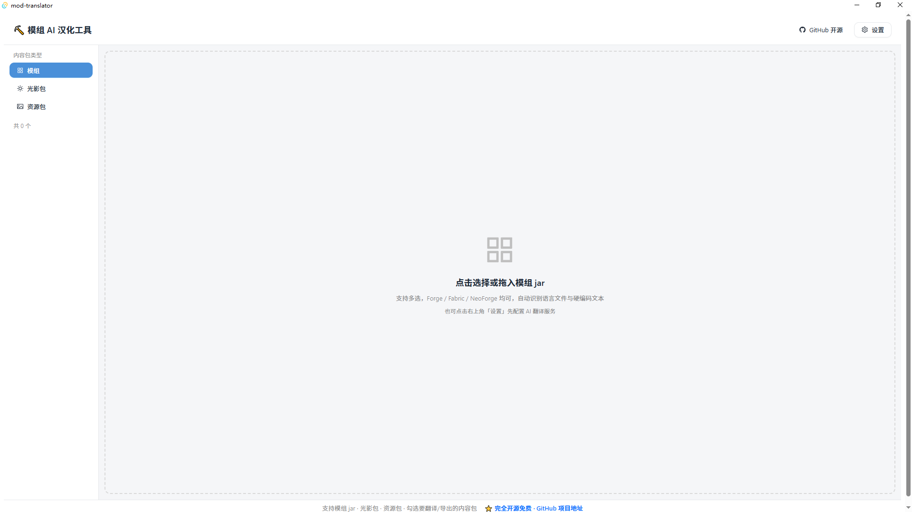
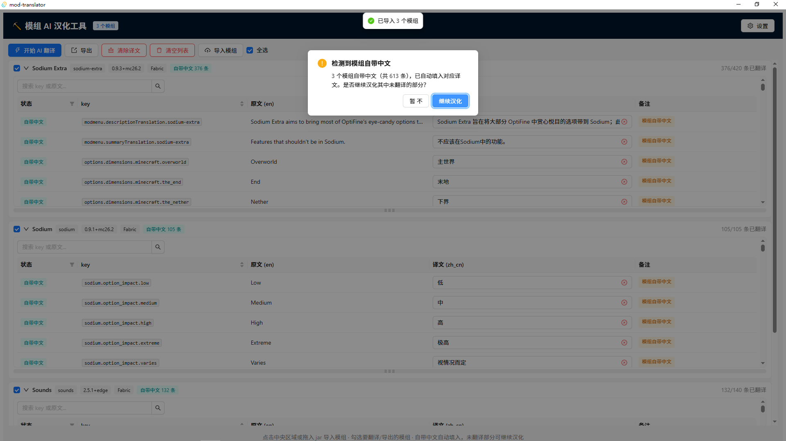
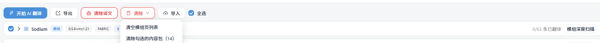
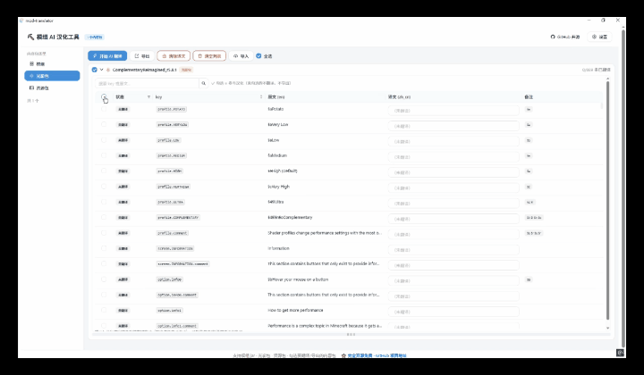
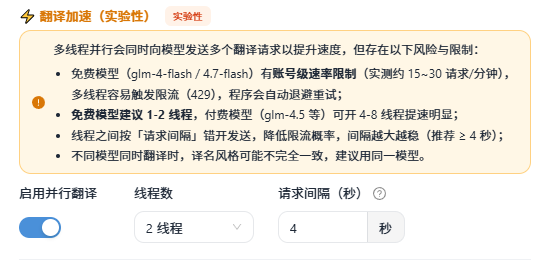
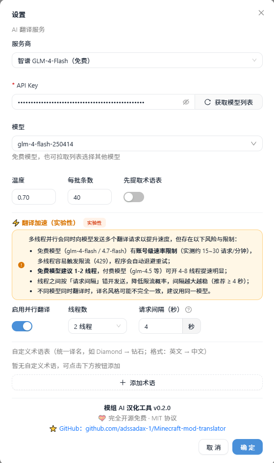
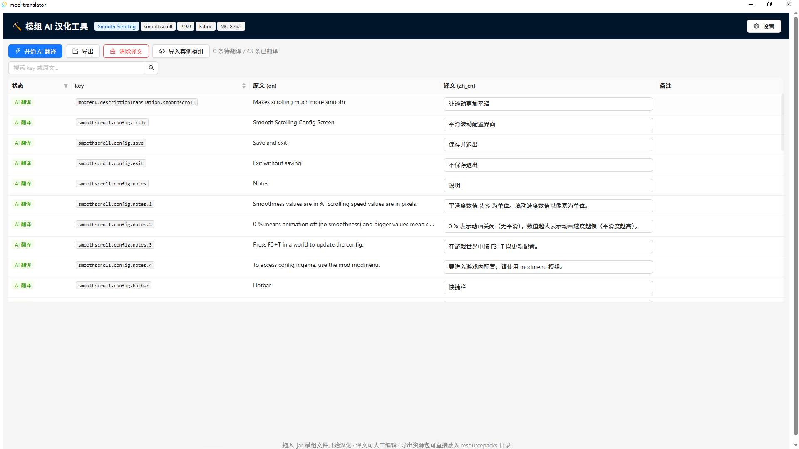
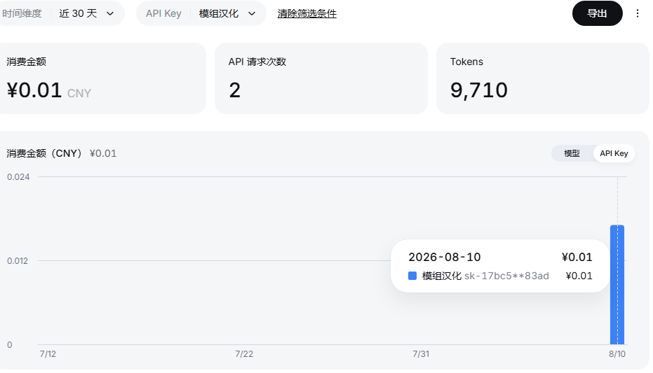

# ⛏ 模组 AI 汉化工具 (Mod Translator)

一个面向《我的世界》(Minecraft) Java 版的 **AI 汉化桌面工具**：把模组 jar、光影包、资源包拖进窗口，自动解析其中可翻译的文本，结合内容上下文用 AI 翻译成简体中文，导出为汉化资源包、汉化后的模组 jar、汉化光影包或改描述的资源包。

**完全开源免费** · 支持免费 AI 模型（不限次数）· 基于 **Tauri v2 + React + TypeScript + Rust** 构建（Windows / macOS / Linux）。



---

## ✨ 功能一览

| 功能 | 说明 |
|---|---|
| 🗂 **三类内容包支持** | 模组 `.jar` / 光影包 `.zip` / 资源包 `.zip`，左侧导航独立队列，导入时**自动探测类型**（按 zip 结构判定，不误判） |
| 📥 **拖放或点击导入** | 把文件拖进窗口或点击中央区域选择，支持多选；每类内容包有对应导入文案 |
| 📚 **多模组队列** | 每个内容包独立卡片：**复选框勾选**（翻译/导出）、展开/收起、全选、显示区高度可**拖拽调节**（流畅优化） |
| 🔍 **自动识别** | 解析 `assets/<modid>/lang/en_us.json`（1.13+）与 `.lang`（1.12.2），提取 modid、模组名、版本、MC 版本、加载器；无元数据但有语言文件的模组也能解析 |
| ☀️ **光影包解析** | 解析 `shaders/shaders.properties`（空文件自动回退 `shaders/lang/en_US.lang`），自动填充自带 `zh_CN.lang`；导出生成汉化光影包（写入 `zh_CN.lang`，不破坏原包） |
| 🎨 **资源包解析** | 解析 `pack.mcmeta` 描述（支持字符串 / `{text,extra}` 对象 / 多语言 `en_us` 格式）；导出生成改描述的资源包 |
| 🇨🇳 **自带中文检测** | 自动检测自带 `zh_cn`/`zh_hk`/`zh_tw`：**简体优先**，只有繁体时**自动转简体**；空值/英文占位不算已翻译；已有中文自动填入 |
| ☑️ **条目级汉化选择** | 每个条目可独立勾选：勾选 = 参与汉化；**未勾选的不翻译、不导出**，表头支持全选/全不选 |
| 🖱 **拖动批量勾选** | 按住行内空白处拖动（可**拖出边缘自动滚动**），框选范围内的行一键勾选/取消；基于生产级拖选框架，流畅不卡顿 |
| ✏️ **译文直接编辑** | 译文列点击即可直接输入修改，不再弹出详情；**单条清除译文**（不满意可单独清除重新翻译） |
| 🧠 **上下文感知翻译** | 按内容类型使用**差异化提示词**：模组（物品/方块/成就语境 + MC 官方译名表）、光影包（GUI 设置界面 + 20+ 图形术语）、资源包（描述文案，保留版本号/作者）；第一轮提取术语表统一译名 |
| 🔒 **占位符保护** | `%s`、`%1$s`、`%d`、`\n`、`§` 颜色码翻译后自动校验数量与顺序，异常标红 |
| 🔎 **硬编码文本扫描** | 自动扫描 `advancements/`、`patchouli_books/`、`config/` 中的英文，翻译后**回写 jar 内 json** |
| 🛡 **JSONC 兼容** | 支持带 `//` 注释、尾逗号的非标准语言 JSON（如 Carpet 模组） |
| ⚡ **翻译加速（实验性）** | 多线程并行翻译：线程数 1-8 + 请求间隔可调；内置免费/付费模型速率建议与限流自动退避 |
| ⏸ **暂停 / 取消 / 清除** | 翻译中可暂停/继续/取消；一键清除全部译文或清空整个内容包列表 |
| 🧩 **多服务商可切换** | 智谱 GLM / Google Gemini / DeepSeek / 阿里百炼 Qwen / 自定义（OpenAI 兼容）；各服务商独立保存 Key 与模型，填 Key 后一键拉取模型列表（免费模型有标注） |
| 📦 **多种导出** | 模组：合并汉化资源包 / 汉化 jar；光影包：汉化光影包（`zh_CN.lang`）；资源包：改描述资源包——均不覆盖原文件 |
| 📐 **pack_format 自动匹配** | 按 Minecraft Wiki 全版本对照表自动匹配（1.6.1 → 1.26.2），支持自定义；1.21.9+ 自动改用 `min_format`/`max_format` |
| ⚡ **虚拟滚动性能** | 条目超过 200 条自动启用虚拟滚动，只渲染可视行——几千条大模组、Tab 切换、批量操作都不卡 |
| 💰 **低成本** | 支持智谱免费模型（不限次数）；实测 DeepSeek 翻译 40 条内容约 ¥0.01 |

---

## 🚀 快速开始

1. **下载**：从 [Releases](https://github.com/adssadax-1/Minecraft-mod-translator/releases) 下载安装包（或 clone 源码自行构建，见下文）。
2. **配置 API Key**：打开程序 → 右上角「设置」→ 选择服务商 → 填入 API Key → 点「获取模型列表」选择模型 → 保存。
3. **导入内容包**：点击中央区域或拖入文件（模组 `.jar` / 光影包 / 资源包 `.zip`，可多选），自动识别类型并解析全部可翻译条目；自带中文自动填入。
4. **开始翻译**：勾选要翻译的内容包 → 点「开始 AI 翻译」，观察进度（可暂停/取消）。



5. **人工审校**：表格中直接修改译文；对不满意的条目，点译文框右侧红色 ✕ 单独清除重新翻译；可用**拖动批量勾选**控制哪些条目参与汉化。



6. **导出**：点「导出」→ 按类型选择：
   - 模组：**合并汉化资源包**（一个 zip 管多个模组）/ **汉化 jar**（不覆盖原文件）
   - 光影包：生成 `xxx_zh_CN.zip`（写入 `shaders/lang/zh_CN.lang`，OptiFine 自动加载）
   - 资源包：生成改描述的资源包

> 💡 1.12.2 及更早版本的中文显示还需要字体补丁（如 CFPA 汉化包的字体），导出 `.lang` 时程序会给出提示。

---

## 🖱 拖动批量勾选

按住表格行内**空白处**（原文/key/状态列）上下拖动，框选经过的行自动勾选；从已勾选的行开始拖则批量取消。拖到表格**上/下边缘会自动滚动**，可连续选中大片区域。复选框、按钮、输入框等交互元素不触发框选，点击功能不受影响。



---

## ⚡ 翻译加速（实验性多线程）

设置 →「⚡ 翻译加速」：



- **线程数 1-8**：多线程并行向模型发送翻译请求，显著提升速度
- **请求间隔（秒）**：每个线程请求之间的间隔，间隔越大越不容易触发限流（推荐 ≥ 4s）
- **风险提示（已内置）**：免费模型有账号级速率限制（实测约 15-30 请求/分钟），多线程容易触发 429，程序会自动退避重试；**免费模型建议 1-2 线程，付费模型可开 4-8 线程**；不同模型同时翻译译名风格可能不一致，建议同模型

---

## 🔑 如何获取 API Key

在程序右上角「设置」中配置翻译服务，各服务商独立保存 Key 与模型选择：



### 智谱 GLM（推荐：有免费模型，国内直连）

1. 打开 [智谱开放平台 bigmodel.cn](https://open.bigmodel.cn/) 注册账号，完成**手机号实名认证**（免费）
2. 进入**控制台** → 左侧「**API 密钥**」→ 「**创建新的密钥**」
3. 复制生成的 Key（形如 `xxxxxxxx.xxxxxxxx`）
4. 在程序「设置」中选择「智谱 GLM-4-Flash（免费）」，粘贴 Key，点「获取模型列表」

**免费模型**：`glm-4-flash-250414`、`glm-4.7-flash`（官方免费，有并发/每日额度，批量翻译遇到限流会自动退避重试）。付费模型如 `glm-4.5-air` 按 token 计费，需账户有余额。

### Google Gemini（免费层）

1. 打开 [Google AI Studio](https://aistudio.google.com/apikey)，用 Google 账号登录
2. 点「Create API key」生成 Key
3. 程序设置中选择「Google Gemini（免费层）」粘贴即可
4. 注意：免费层有请求额度限制，内容可能用于训练，敏感数据请勿使用

### DeepSeek（低价）

1. 打开 [platform.deepseek.com](https://platform.deepseek.com/) 注册并充值
2. 左侧「API Keys」→「创建 API Key」
3. 程序设置中选择「DeepSeek」粘贴

#### DeepSeek 实测成本

实测（`deepseek-chat`，即 DeepSeek V4-flash 系列）：翻译 40 条模组汉化内容，消耗 **9,710 tokens，费用约 ¥0.01 元**，成本极低。





### 阿里百炼 Qwen（低价）

1. 打开 [阿里云百炼](https://bailian.console.aliyun.com/) 开通模型服务，完成实名
2. 控制台右上角「API-KEY」→ 创建
3. 程序设置中选择「阿里百炼 Qwen」粘贴

> 所有服务商均支持「获取模型列表」一键拉取，**免费模型在列表中有绿色"（免费模型）"标注**。

---

## 🔒 数据与隐私

- **API Key 存储**：仅保存在本机配置文件 `%APPDATA%/com.administrator.mod-translator/settings.json`（macOS: `~/Library/Application Support/...`），**不会**上传到任何第三方、不进代码仓库、不进日志
- **翻译内容**：条目文本仅发送给你自己选择的服务商用于翻译
- **翻译质量提示**：AI 翻译仅供参考，建议导出前人工审校；专有名词可通过「设置 → 自定义术语表」锁定译名

---

## 🛠 开发与构建

```bash
# 环境要求
# - Node.js 18+ 与 npm
# - Rust stable（rustup）
# - Windows: Visual Studio Build Tools（C++ 桌面开发工作负载）；macOS: Xcode CLT；Linux: webkit2gtk 等

# 安装依赖
npm install

# 开发模式（热重载）
npm run tauri dev

# 运行 Rust 单元测试
cd src-tauri && cargo test

# 打包安装程序（NSIS/MSI 等，按平台）
npm run tauri build

# 仅构建免安装版 exe（不打安装包）
npm run tauri build -- --no-bundle
```

## 📁 项目结构

```
src/                  # React 前端
  App.tsx             # 主布局 + 三类内容包队列 + 拖放/翻译/导出流程
  components/         # DropZone / EntryTable / ContextPanel / SettingsModal
  api.ts              # Tauri invoke + 事件封装
  types.ts            # 类型定义 + pack_format 版本对照
src-tauri/src/
  core/               # jar 解包、lang/json 解析、占位符提取校验、光影/资源包解析
  translate/          # provider（OpenAI 兼容）+ 翻译流水线（术语表/批量/校验/重试/多线程）
  export.rs           # 导出资源包 / 回写 jar
  settings.rs         # 设置持久化（含多线程配置）
  commands.rs         # Tauri 命令层（含暂停/取消机制）
```

## 📜 开源协议

本项目使用 **MIT 协议**，详见 [LICENSE](LICENSE) 文件。

---

## 📋 版本记录

### v1.0.0（2026-08）正式版

- **三类内容包**：模组 jar / 光影包 / 资源包，自动类型探测，独立队列
- **光影包汉化**：解析 shaders.properties（含 en_US.lang 回退）+ 导出 zh_CN.lang
- **资源包汉化**：解析 pack.mcmeta 描述（对象/多语言格式兼容）+ 导出改描述
- **差异化翻译提示词**：模组 / 光影包（图形术语表）/ 资源包三套语境
- **条目级汉化选择**：逐条勾选是否参与汉化（不翻译、不导出）
- **拖动批量勾选**：框选 + 边缘自动滚动（生产级拖选框架）
- **译文直接编辑**：点击即改，不再弹出详情
- **多线程翻译加速**（实验性）：1-8 线程 + 请求间隔 + 速率建议
- **性能优化**：卡片/行级 memo + 虚拟滚动，几千条大模组流畅操作
- **修复**：导出文件验证、description 多格式解析、光影空 properties 回退、类型误判

### v0.2.0（2026-08）

- 多模组队列、点击导入、自带中文检测（繁转简）、硬编码文本扫描、JSONC 兼容
- 单条清除译文、清空列表、拖动调节高度、多模组导出、无元数据模组解析

### v0.1.0（2026-08）

- 初版：拖放导入、AI 翻译（上下文感知 + 占位符保护）、人工审校、多服务商、导出资源包/汉化 jar、pack_format 自动匹配

---

## 🙏 致谢

- [Y-RyuZU/MinecraftModsLocalizer](https://github.com/Y-RyuZU/MinecraftModsLocalizer)（Tauri + AI 翻译思路）
- [Tryanks/WebTranslator](https://github.com/Tryanks/WebTranslator)（.lang / json 双格式处理）
- [CFPAOrg/Minecraft-Mod-Language-Package](https://github.com/CFPAOrg/Minecraft-Mod-Language-Package)（社区翻译对照与字体补丁）
- Minecraft Wiki（pack_format 版本对照表）
