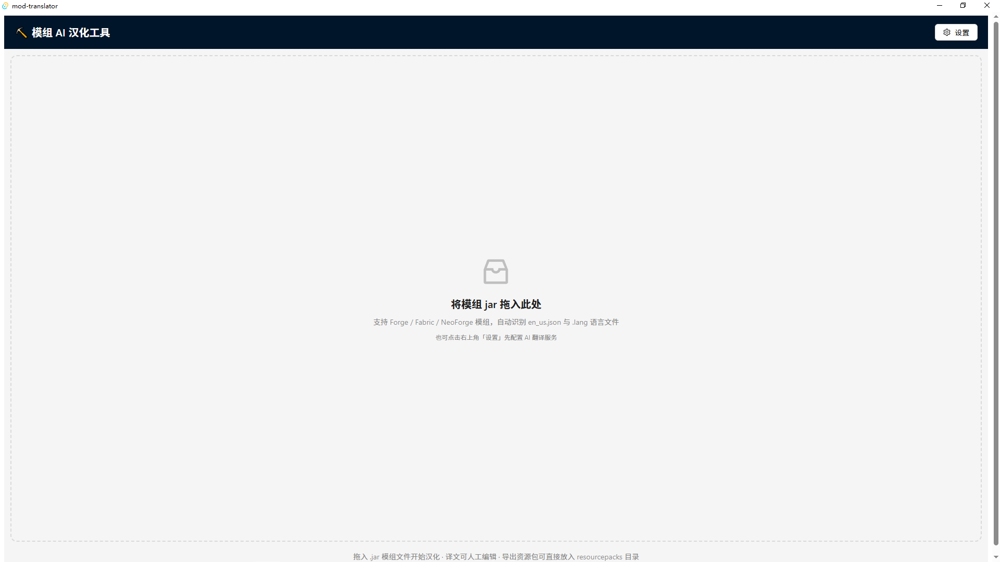
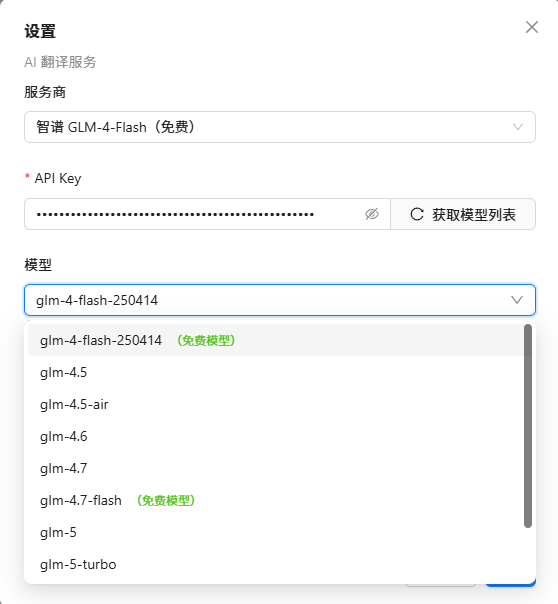

# ⛏ 模组 AI 汉化工具 (Mod Translator)

一个面向《我的世界》(Minecraft) Java 版模组的 **AI 汉化桌面工具**：把模组 jar 拖进窗口，自动解析语言文件，结合模组上下文用 AI 翻译成简体中文，导出为汉化资源包或直接生成汉化后的模组 jar。

基于 **Tauri v2 + React + TypeScript + Rust** 构建，跨平台（Windows / macOS / Linux）。

---

## ✨ 功能

| 功能 | 说明 |
|---|---|
| 🗂 **拖放导入** | 把 `.jar` 模组拖进窗口即自动解析，支持 Forge / Fabric / NeoForge |
| 🔍 **自动识别** | 解析 `assets/<modid>/lang/en_us.json`（1.13+）与 `.lang`（1.12.2），提取 modid、模组名、版本、MC 版本、加载器 |
| 🧠 **上下文感知翻译** | 提示词中明确"这是《我的世界》XX 模组的英文语言文件"，并注入模组名 / modid / MC 版本 / 加载器；内置 Minecraft 官方译名参考表（钻石、下界、附魔等 30+ 词）；第一轮先让 AI 提取模组术语表，保证全程统一译名 |
| 🔒 **占位符保护** | `%s`、`%1$s`、`%d`、`\n`、`§` 颜色码翻译后自动校验数量与顺序，异常标红提示 |
| ✏️ **人工审校** | 表格双语对照，可编辑任意译文，状态标记（AI 翻译 / 人工确认 / 占位符异常） |
| ⏸ **暂停 / 取消 / 清除** | 翻译中可暂停（继续/取消），可一键清空全部译文重新翻译 |
| 🧩 **多服务商可切换** | 智谱 GLM / Google Gemini / DeepSeek / 阿里百炼 Qwen / 自定义（OpenAI 兼容端点）；每个服务商独立保存 API Key 与模型选择，填 Key 后一键拉取模型列表 |
| 📦 **两种导出** | ① 汉化资源包（`.zip`，放入游戏 resourcepacks 目录）② 汉化后的模组 jar（复制原模组写入中文，不覆盖原文件） |
| 📐 **pack_format 自动匹配** | 导出资源包时按 Minecraft Wiki 版本对照表自动匹配 pack_format（1.6.1 → 1.26.2 全版本），也支持自定义数值；1.21.9+ 自动改用 `min_format`/`max_format` |

---

## 🚀 快速开始



1. **下载**：从 [Releases](https://github.com/adssadax-1/Minecraft-mod-translator/releases) 下载安装包，或 clone 源码自行构建（见下文）。
2. **配置 API Key**：打开程序 → 右上角「设置」→ 选择服务商 → 填入 API Key → 点「获取模型列表」选择模型 → 保存。
3. **拖入模组**：把模组 `.jar` 拖进窗口，自动解析出全部语言条目。
4. **开始翻译**：点「开始 AI 翻译」，观察进度（可暂停/取消）。
5. **人工审校**：表格中修改不满意的译文，检查「占位符异常」标红的条目。
6. **导出**：点「导出」→ 二选一：
   - **导出汉化资源包**：设置 pack_format（默认按 MC 版本自动匹配）→ 选目录 → 生成 `<modid>_zh_cn.zip`，放入游戏 `resourcepacks` 文件夹启用
   - **生成汉化后的模组 jar**：另存为 `<modid>_zh_cn.jar`，替换原模组即可

> 💡 1.12.2 及更早版本的中文显示还需要字体补丁（如 CFPA 汉化包的字体），导出 `.lang` 时程序会给出提示。

---

## 🔑 如何获取 API Key

在程序右上角「设置」中配置翻译服务，各服务商独立保存 Key 与模型选择：



### 智谱 GLM（推荐：有免费模型，国内直连）

1. 打开 [智谱开放平台 bigmodel.cn](https://open.bigmodel.cn/) 注册账号，完成**手机号实名认证**（免费）
2. 进入**控制台** → 左侧「**API 密钥**」→ 「**创建新的密钥**」
3. 复制生成的 Key（形如 `xxxxxxxx.xxxxxxxx`）
4. 在程序「设置」中选择「智谱 GLM-4-Flash（免费）」，粘贴 Key，点「获取模型列表」

**免费模型**：`glm-4-flash-250414`、`glm-4.7-flash`（官方免费，有并发/每日额度，批量翻译遇到限流会自动退避重试）。付费模型如 `glm-4.5-air` 按 token 计费，需账户有余额。

### Google Gemini（免费层）

1. 打开 [Google AI Studio](https://aistudio.google.com/apikey)，用 Google 账号登录
2. 点「Create API key」生成 Key
3. 程序设置中选择「Google Gemini（免费层）」粘贴即可
4. 注意：免费层有请求额度限制，内容可能用于训练，敏感数据请勿使用

### DeepSeek（低价）

1. 打开 [platform.deepseek.com](https://platform.deepseek.com/) 注册并充值
2. 左侧「API Keys」→「创建 API Key」
3. 程序设置中选择「DeepSeek」粘贴

#### DeepSeek 实测成本

实测（`deepseek-chat`，即 DeepSeek V4-flash 系列）：翻译 40 条模组汉化内容，消耗 **9,710 tokens，费用约 ¥0.01 元**，成本极低。


### 阿里百炼 Qwen（低价）

1. 打开 [阿里云百炼](https://bailian.console.aliyun.com/) 开通模型服务，完成实名
2. 控制台右上角「API-KEY」→ 创建
3. 程序设置中选择「阿里百炼 Qwen」粘贴

> 所有服务商均支持「获取模型列表」一键拉取，**免费模型在列表中有绿色"（免费模型）"标注**。

---

## 🔒 数据与隐私

- **API Key 存储**：仅保存在本机配置文件 `%APPDATA%/com.administrator.mod-translator/settings.json`（macOS: `~/Library/Application Support/...`），**不会**上传到任何第三方、不进代码仓库、不进日志
- **翻译内容**：条目文本仅发送给你自己选择的服务商用于翻译
- **翻译质量提示**：AI 翻译仅供参考，建议导出前人工审校；专有名词可通过「设置 → 自定义术语表」锁定译名

---

## 🛠 开发与构建

```bash
# 环境要求
# - Node.js 18+ 与 npm
# - Rust stable（rustup）
# - Windows: Visual Studio Build Tools（C++ 桌面开发工作负载）；macOS: Xcode CLT；Linux: webkit2gtk 等

# 安装依赖
npm install

# 开发模式（热重载）
npm run tauri dev

# 运行 Rust 单元测试
cd src-tauri && cargo test

# 打包安装程序（NSIS/MSI 等，按平台）
npm run tauri build

# 仅构建免安装版 exe（不打安装包）
npm run tauri build -- --no-bundle
```

## 📁 项目结构

```
src/                  # React 前端
  App.tsx             # 主布局 + 状态 + 拖放/翻译/导出流程
  components/         # DropZone / EntryTable / ContextPanel / SettingsModal
  api.ts              # Tauri invoke + 事件封装
  types.ts            # 类型定义 + pack_format 版本对照
src-tauri/src/
  core/               # jar 解包、lang/json 解析、占位符提取校验
  translate/          # provider（OpenAI 兼容）+ 翻译流水线（术语表/批量/校验/重试）
  export.rs           # 导出资源包 / 回写 jar
  settings.rs         # 设置持久化
  commands.rs         # Tauri 命令层（含暂停/取消机制）
```

## 📜 开源协议

本项目使用 **MIT 协议**，详见 [LICENSE](LICENSE) 文件。

---

## 🙏 致谢

- [Y-RyuZU/MinecraftModsLocalizer](https://github.com/Y-RyuZU/MinecraftModsLocalizer)（Tauri + AI 翻译思路）
- [Tryanks/WebTranslator](https://github.com/Tryanks/WebTranslator)（.lang / json 双格式处理）
- [CFPAOrg/Minecraft-Mod-Language-Package](https://github.com/CFPAOrg/Minecraft-Mod-Language-Package)（社区翻译对照与字体补丁）
- Minecraft Wiki（pack_format 版本对照表）
